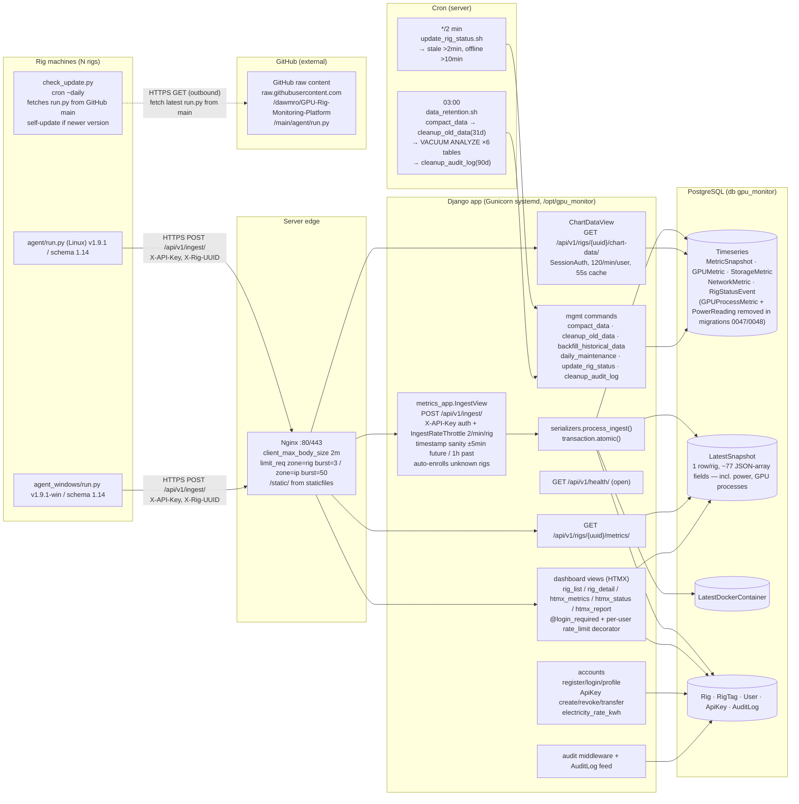

# 🖥️ GPU Rig Monitoring Platform

[](https://www.python.org/)
[](https://www.djangoproject.com/)
[](https://www.postgresql.org/)
[](https://htmx.org/)
[](LICENSE)
[](https://github.com/dawmro/GPU-Rig-Monitoring-Platform/actions)

> **A production-ready, single-server telemetry platform for monitoring GPU rigs running AI/ML workloads.** Collects hardware metrics from remote agents and displays them in a real-time, server-rendered web dashboard with zero JavaScript frameworks.


---

## 🎯 Overview

| Metric | Value |
|--------|-------|
| **Architecture** | Single VPS (Django + Gunicorn + Nginx + PostgreSQL) |
| **Agents** | Linux (cron) & Windows (Task Scheduler) |
| **Agent version** | v1.9.1 (Linux) / v1.9.1-win (Windows) — schema 1.14 |
| **Collection Interval** | 60 seconds |
| **Scale Target** | 1,000+ rigs |
| **Data Retention** | 31 days (3-tier compaction: 1m → 15m → 1h) |
| **Storage/rig (31d)** | ~28 MB (94% compression) |

---

## ✨ Key Features

### 📊 Live Dashboard
- **Fleet Overview** — All rigs at a glance with per-GPU summaries, tag filtering, status badges
- **Live Metrics** — Auto-refreshing cards (30s HTMX polling): CPU, Memory, GPU, Storage, Network, Docker, Errors, Top Processes
- **Historical Charts** — 15+ multi-series time-range charts (24h/7d/30d): GPU temp/util/memory/power/clocks, CPU temp/util/freq, Storage, Network, Error frequency

### 🖥️ Hardware Coverage
| Category | Metrics | Linux | Windows |
|----------|---------|:-----:|:-------:|
| **CPU** | Model, cores, load avg, temp, utilization %, frequency | ✅ | ✅ |
| **Memory** | Total, used, free, cached, swap | ✅ | ✅ |
| **GPU** | Model, VRAM (used/free/total), util %, temp, power, fan, PCIe, clocks | ✅ | ✅ |
| **GPU Processes** | Name, type (C/G/C+G), memory | ✅ | ✅ |
| **Storage** | Capacity, usage %, SMART, NVMe logs, temp, read/write bytes/IOPS, utilization | ✅ | ✅ |
| **Network** | Per-interface IPv4, speed, RX/TX bytes, errors | ✅ | ✅ |
| **Docker** | Count, names, images, status, container ID, uptime | ✅ | ✅ |
| **Top Processes** | Top 20 by CPU/memory (pid, name, cpu%, mem%, user, cmdline) | ✅ | ✅ |
| **Errors** | System errors with deduplication (1000-entry rolling buffer) | ✅ | ✅ |

### 🔐 Security & Operations
- **Per-rig rate limiting** — 2 req/min per `rig_uuid` (burst=5)
- **Timestamp validation** — Rejects payloads >5 min future or >1 hour past
- **Dual authentication** — `X-API-Key` (user) + `X-Rig-UUID` (rig identification)
- **Agent isolation** — API keys scoped to user; no cross-user rig access
- **API Key Management** — Create, revoke, reactivate, delete, transfer between users (admin)

---

## 🏗️ Architecture

```
┌────────────────────────────────────────────────────────────────────────────────────┐
│                           RIG FLEET (Untrusted, N rigs)                            │
│                                                                                    │
│  ┌──────────────────────────────────────────────────────────────────────────────┐  │
│  │  METRICS INGESTION PATH (cron ~60s)                                          │  │
│  │                                                                              │  │
│  │  ┌────────────────────┐         ┌────────────────────┐                       │  │
│  │  │ Linux Agent        │         │ Windows Agent      │                       │  │
│  │  │ agent/run.py       │         │ agent_windows/     │                       │  │
│  │  │ v1.9.1, schema 1.14│         │ run.py v1.9.1-win  │                       │  │
│  │  └─────────┬──────────┘         └─────────┬──────────┘                       │  │
│  │            │                              │                                  │  │
│  │            │ HTTPS POST                   │ HTTPS POST                       │  │
│  │            │ /api/v1/ingest/              │ /api/v1/ingest/                  │  │
│  │            │ X-API-Key, X-Rig-UUID        │ X-API-Key, X-Rig-UUID            │  │
│  │            └──────────────┬───────────────┘                                  │  │
│  │                           │                                                  │  │
│  │                           ▼                                                  │  │
│  │                    ┌──────────────┐                                          │  │
│  │                    │   Nginx      │                                          │  │
│  │                    │   (Server)   │                                          │  │
│  │                    └──────────────┘                                          │  │
│  └──────────────────────────────────────────────────────────────────────────────┘  │
│                                                                                    │
│  ┌──────────────────────────────────────────────────────────────────────────────┐  │
│  │  UPDATE CHECK (cron ~daily, independent)                                     │  │
│  │  ┌────────────────────────────────────────────────────────────────────────┐  │  │
│  │  │ check_update.py                                                        │  │  │
│  │  │ • Queries GitHub API for latest release                                │  │  │
│  │  │   https://github.com/dawmro/GPU-Rig-Monitoring-Platform                │  │  │
│  │  │ • Triggers self-update if newer version available                      │  │  │
│  │  │ • Completely outbound, NOT in ingest path                              │  │  │
│  │  └────────────────────────────────────────────────────────────────────────┘  │  │
│  └──────────────────────────────────────────────────────────────────────────────┘  │
│                                                                                    │
│                              ┌────────────────────┐                                │
│                              │   GitHub API       │                                │
│                              │   (external)       │                                │
│                              └────────────────────┘                                │
│                                    ▲                                               │
│                                    │ HTTPS GET (outbound)                          │
│                                    │ check_update.py → GitHub                      │
│                                                                                    │
└────────────────────────────────────────────────────────────────────────────────────┘
                                            │
                                            │ HTTPS :443 (TLS terminated)
                                            │ Rate limits: zone=rig burst=3, zone=ip burst=50
                                            │ client_max_body_size: 2m
                                            │ /static/ → staticfiles
                                            ▼
┌────────────────────────────────────────────────────────────────────────────────────────┐
│                        SINGLE UBUNTU VPS (Trusted, /opt/gpu_monitor)                   │
│                                                                                        │
│  ┌──────────────────────────────────────────────────────────────────────────────────┐  │
│  │                              NGINX (Reverse Proxy)                               │  │
│  │  • TLS termination (:80 → :443 redirect)                                         │  │
│  │  • Rate limiting per rig + per IP                                                │  │
│  │  • Static file serving                                                           │  │
│  └──────────────────────────────────────────────────────────────────────────────────┘  │
│                                      │                                                 │
│                                      │ proxy_pass http://127.0.0.1:8000                │
│                                      ▼                                                 │
│  ┌─────────────────────────────────────────────────────────────────────────────────┐   │
│  │                         DJANGO + DRF (Gunicorn 4w, systemd)                     │   │
│  │                                                                                 │   │
│  │  ┌──────────────────────────────────────────────────────────────────────────┐   │   │
│  │  │ INGESTION LAYER                                                          │   │   │
│  │  │ • IngestView POST /api/v1/ingest/                                        │   │   │
│  │  │   - X-API-Key auth + IngestRateThrottle (2/min/rig)                      │   │   │
│  │  │   - Timestamp sanity: ±5min future / 1h past                             │   │   │
│  │  │   - Auto-enrolls unknown rigs                                            │   │   │
│  │  │ • serializers.process_ingest() [transaction.atomic()]                    │   │   │
│  │  └──────────────────────────────────────────────────────────────────────────┘   │   │
│  │                                                                                 │   │
│  │  ┌──────────────────────────────────────────────────────────────────────────┐   │   │
│  │  │ READ APIs (SessionAuth, rate-limited)                                    │   │   │
│  │  │ • ChartDataView GET /api/v1/rigs/{uuid}/chart-data/                      │   │   │
│  │  │   - 120/min/user, 55s cache                                              │   │   │
│  │  │ • GET /api/v1/rigs/{uuid}/metrics/                                       │   │   │
│  │  │ • GET /api/v1/health/ (open, no auth)                                    │   │   │
│  │  └──────────────────────────────────────────────────────────────────────────┘   │   │
│  │                                                                                 │   │
│  │  ┌──────────────────────────────────────────────────────────────────────────┐   │   │
│  │  │ HTMX DASHBOARD (@login_required + per-user rate_limit)                   │   │   │
│  │  │ • rig_list, rig_detail                                                   │   │   │
│  │  │ • htmx_metrics, htmx_status, htmx_report                                 │   │   │
│  │  │ • 30s polling via HTMX                                                   │   │   │
│  │  └──────────────────────────────────────────────────────────────────────────┘   │   │
│  │                                                                                 │   │
│  │  ┌──────────────────────────────────────────────────────────────────────────┐   │   │
│  │  │ ACCOUNTS & SECURITY                                                      │   │   │
│  │  │ • register/login/profile                                                 │   │   │
│  │  │ • ApiKey create/revoke/transfer                                          │   │   │
│  │  │ • electricity_rate_kwh configuration                                     │   │   │
│  │  └──────────────────────────────────────────────────────────────────────────┘   │   │
│  │                                                                                 │   │
│  │  ┌──────────────────────────────────────────────────────────────────────────┐   │   │
│  │  │ AUDIT & MAINTENANCE                                                      │   │   │
│  │  │ • Audit middleware + AuditLog feed                                       │   │   │
│  │  │ • Management commands:                                                   │   │   │
│  │  │   compact_data, cleanup_old_data, backfill_historical_data,              │   │   │
│  │  │   daily_maintenance, update_rig_status, cleanup_audit_log                │   │   │
│  │  └──────────────────────────────────────────────────────────────────────────┘   │   │
│  └─────────────────────────────────────────────────────────────────────────────────┘   │
│           │                          │                          │                      │
│           │ TCP/5432                 │ TCP/5432                 │ TCP/5432             │
│           ▼                          ▼                          ▼                      │
│  ┌─────────────────────────────────────────────────────────────────────────────────┐   │
│  │                         POSTGRESQL 16 (db: gpu_monitor)                         │   │
│  │                                                                                 │   │
│  │  ┌──────────────────────────────────────────────────────────────────────────┐   │  │
│  │  │ TIMESERIES TABLES (high write volume, 31d retention)                     │   │  │
│  │  │ • MetricSnapshot  • GPUMetric       • StorageMetric                      │   │  │
│  │  │ • NetworkMetric   • RigStatusEvent                                       │   │  │
│  │  │   (GPUProcessMetric removed in migration 0047 — denormalized             │   │  │
│  │  │    into LatestSnapshot.gpu_processes_json)                                 │   │  │
│  │  │   (PowerReading removed in migration 0048 — power data lives in          │   │  │
│  │  │    MetricSnapshot.cpu_power_w/total_system_power_w + GPUMetric.power_draw_w)│   │  │
│  │  └──────────────────────────────────────────────────────────────────────────┘   │  │
│  │                                                                                 │   │  │
│  │  ┌──────────────────────────────────────────────────────────────────────────┐   │  │
│  │  │ LATEST STATE (1 row/rig, denormalized)                                   │   │  │
│  │  │ • LatestSnapshot (~77 JSON-array fields — incl. power, GPU processes)    │   │  │
│  │  │ • LatestDockerContainer                                                  │   │  │
│  │  └──────────────────────────────────────────────────────────────────────────┘   │  │
│  │                                                                                 │   │
│  │  ┌──────────────────────────────────────────────────────────────────────────┐   │   │
│  │  │ CORE TABLES (relational, low churn)                                      │   │   │
│  │  │ • Rig • RigTag • User • ApiKey • AuditLog                                │   │   │
│  │  └──────────────────────────────────────────────────────────────────────────┘   │   │
│  └─────────────────────────────────────────────────────────────────────────────────┘   │
│                                                                                        │
│  ┌─────────────────────────────────────────────────────────────────────────────────┐   │
│  │                              CRON (server-side)                                 │   │
│  │                                                                                 │   │
│  │  ┌────────────────────────────────┐    ┌────────────────────────────────────┐   │   │
│  │  │ */2 min:                       │    │ 03:00 daily:                       │   │   │
│  │  │ update_rig_status.sh           │    │ data_retention.sh                  │   │   │
│  │  │ → stale >2min, offline >10min  │    │ → compact_data                     │   │   │
│  │  │ → calls update_rig_status cmd  │    │ → cleanup_old_data(31d)            │   │   │
│  │  └────────────────────────────────┘    │ → VACUUM ANALYZE ×6 tables         │   │   │
│  │                                        │ → cleanup_audit_log(90d)           │   │   │
│  │                                        └────────────────────────────────────┘   │   │
│  └─────────────────────────────────────────────────────────────────────────────────┘   │
│                                                                                        │
└────────────────────────────────────────────────────────────────────────────────────────┘
                                            ▲
                                            │ HTTPS GET/POST + HTMX polling (30s)
                                            │ SessionAuth, per-user rate limits
                                            │
                              ┌─────────────┴─────────────┐
                              │      USER BROWSER         │
                              │  (authenticated session)  │
                              └───────────────────────────┘
```



**Stack:** Django 6.x + DRF · PostgreSQL 16 · Gunicorn (4 workers) · Nginx (TLS 1.3, rate limiting) · HTMX 1.9 (server-rendered, no SPA)

---

## 🚀 Quick Start

### Local Development (5 minutes)

```bash
# 1. Clone & setup
git clone https://github.com/dawmro/GPU-Rig-Monitoring-Platform.git
cd GPU-Rig-Monitoring-Platform

# 2. Server setup (single machine)
sudo mkdir -p /opt/gpu_monitor
sudo chown "$USER:$USER" /opt/gpu_monitor
cp -r gpu_monitor/* /opt/gpu_monitor/

# 3. Database & environment
sudo apt update && sudo apt install -y python3-venv postgresql nginx
sudo -u postgres psql -c "CREATE USER gpu_monitor WITH PASSWORD 'local_dev_password';"
sudo -u postgres psql -c "CREATE DATABASE gpu_monitor OWNER gpu_monitor;"

cd /opt/gpu_monitor
python3 -m venv venv
source venv/bin/activate
pip install django djangorestframework django-htmx psycopg2-binary argon2-cffi gunicorn requests pyyaml psutil

# 4. Configure & run
cat > .env << 'EOF'
DJANGO_SECRET_KEY=$(python3 -c "import secrets; print(secrets.token_urlsafe(50))")
DJANGO_DEBUG=True
DJANGO_ALLOWED_HOSTS=*
DB_NAME=gpu_monitor
DB_USER=gpu_monitor
DB_PASSWORD=local_dev_password
DB_HOST=127.0.0.1
DB_PORT=5432
EOF

source venv/bin/activate
set -a && source .env && set +a
python manage.py migrate
python manage.py collectstatic --noinput
python manage.py createsuperuser

# 5. Nginx + Gunicorn
sudo cp deploy/nginx.conf /etc/nginx/sites-available/gpu_monitor
sudo ln -sf /etc/nginx/sites-available/gpu_monitor /etc/nginx/sites-enabled/
sudo nginx -t && sudo systemctl restart nginx
sudo cp deploy/gunicorn.service /etc/systemd/system/
sudo systemctl daemon-reload && sudo systemctl enable --now gunicorn
```

**Access:** `http://localhost` → auto-redirects to dashboard or login

---

## 📁 Repository Structure

```
GPU-Rig-Monitoring-Platform/
├── agent/                      # Linux monitoring agent
├── agent_windows/              # Windows monitoring agent
├── gpu_monitor/                # Django project
│   ├── deploy/                 # Production artifacts (nginx, systemd, cron)
│   ├── metrics_app/            # Ingestion API, timeseries models
│   ├── dashboard/              # HTMX views, templates, tab tags
│   ├── rigs/                   # Rig inventory + status state machine
│   ├── accounts/               # Auth, API keys, audit
│   ├── audit/                  # Activity feed
│   └── templates/              # Django templates
├── scripts/                    # Dev helpers (NOT deployed)
└── docs/                       # Architecture, deployment guides
```

> **Key distinction:** `gpu_monitor/deploy/` = production artifacts (cron, systemd, nginx). `scripts/` = local dev helpers only (never deployed).

---

## 📚 Documentation

| Guide | Description |
|-------|-------------|
| [`docs/DEPLOYMENT_GUIDE.md`](docs/DEPLOYMENT_GUIDE.md) | Production VPS deployment with TLS, domain, firewall |
| [`docs/LOCAL_DEPLOYMENT_GUIDE.md`](docs/LOCAL_DEPLOYMENT_GUIDE.md) | Local testing (no domain, HTTP only) |
| [`docs/GPU_Rig_Monitoring_Architecture.md`](docs/GPU_Rig_Monitoring_Architecture.md) | Full architecture reference (1500+ lines) |
| [`agent/README.md`](agent/README.md) | Linux agent installation & config |
| [`agent_windows/README.md`](agent_windows/README.md) | Windows agent setup |

---

## 🛠️ Development Workflow

```bash
# 1. Make changes in workspace
# 2. Sync to /opt for testing
bash scripts/sync_to_opt.sh          # Full: rsync + migrate + restart
bash scripts/sync_to_opt.sh --no-migrate  # Fast: skip migrations

# 3. Verify, commit to feature branch
# 4. Push and create PR for review
```

---

## 📊 Data Retention (3-Tier Compaction)

| Tier | Age | Bucket | Rows/Day | Savings |
|------|-----|--------|----------|---------|
| Raw | 0–1 day | 1-min | 1,440 | — |
| Tier 2 | 1–7 days | 15-min | 96 | 15× |
| Tier 3 | 7–31 days | 1-hour | 24 | 4× |
| Deleted | 31+ days | — | 0 | 100% |

**Result:** ~94% storage reduction (487 GB → 28 GB for 1000 rigs/month)

---

## 🔧 Tech Stack

| Layer | Technology |
|-------|------------|
| Server | Django 6.x + Django REST Framework |
| Database | PostgreSQL 16 (plain, no TimescaleDB) |
| App Server | Gunicorn (WSGI, 4 workers) |
| Web Server | Nginx (reverse proxy, TLS 1.3) |
| Frontend | Django Templates + HTMX 1.9 (no SPA) |
| Auth | Email/password + API keys + sessions |
| Agents | Python 3.10+, psutil, pynvml, WMI (Windows) |
| Scheduler | Linux: cron · Windows: Task Scheduler |

---

## 🤝 Contributing

1. Fork the repository
2. Create a feature branch (`git checkout -b feat/amazing-feature`)
3. Make changes, run `sync_to_opt.sh` to test
4. Commit with conventional messages (`feat:`, `fix:`, `docs:`)
5. Push and open a Pull Request

---

## 📄 License

MIT License — see [`LICENSE`](LICENSE) for details.

---

## 🙏 Acknowledgments

- [HTMX](https://htmx.org/) — making server-rendered apps feel alive
- [Django](https://www.djangoproject.com/) — the web framework for perfectionists
- [psutil](https://github.com/giampaolo/psutil) — cross-platform system monitoring
- [pynvml](https://github.com/nvidia/nvidia-ml-py) — NVIDIA GPU monitoring

---

<p align="center">
  <strong>Built for GPU farmers, ML engineers, and anyone who needs to know what their rigs are doing.</strong>
</p>
