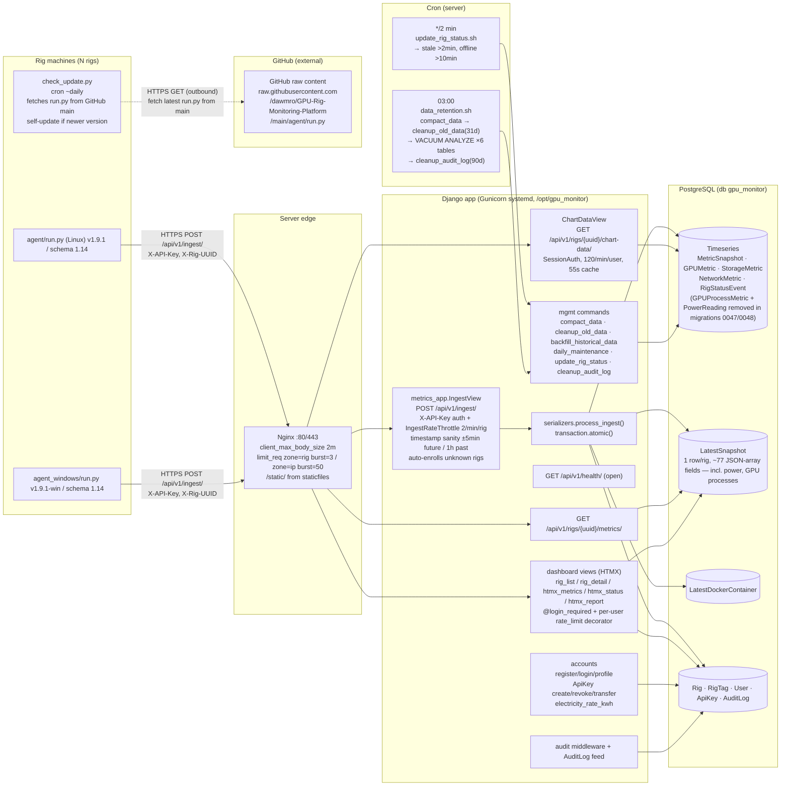

# 🖥️ GPU Rig Monitoring Platform

[](https://www.python.org/)
[](https://www.djangoproject.com/)
[](https://www.postgresql.org/)
[](https://htmx.org/)
[](LICENSE)
[](https://github.com/dawmro/GPU-Rig-Monitoring-Platform/actions)

> **A production-ready, single-server telemetry platform for monitoring GPU rigs running AI/ML workloads.** Collects hardware metrics from remote agents and displays them in a real-time, server-rendered web dashboard with zero JavaScript frameworks.


---

## 🎯 Overview

| Metric | Value |
|--------|-------|
| **Architecture** | Single VPS (Django + Gunicorn + Nginx + PostgreSQL) |
| **Agents** | Linux (cron) & Windows (Task Scheduler) |
| **Agent version** | v1.9.1 (Linux) / v1.9.1-win (Windows) — schema 1.14 |
| **Collection Interval** | 60 seconds |
| **Scale Target** | 1,000+ rigs |
| **Data Retention** | 31 days (3-tier compaction: 1m → 15m → 1h) |
| **Storage/rig (31d)** | ~28 MB (94% compression) |

---

## ✨ Key Features

### 📊 Live Dashboard
- **Fleet Overview** — All rigs at a glance with per-GPU summaries, tag filtering, status badges
- **Live Metrics** — Auto-refreshing cards (30s HTMX polling): CPU, Memory, GPU, Storage, Network, Docker, Errors, Top Processes
- **Historical Charts** — 15+ multi-series time-range charts (24h/7d/30d): GPU temp/util/memory/power/clocks, CPU temp/util/freq, Storage, Network, Error frequency

### 🖥️ Hardware Coverage
| Category | Metrics | Linux | Windows |
|----------|---------|:-----:|:-------:|
| **CPU** | Model, cores, load avg, temp, utilization %, frequency | ✅ | ✅ |
| **Memory** | Total, used, free, cached, swap | ✅ | ✅ |
| **GPU** | Model, VRAM (used/free/total), util %, temp, power, fan, PCIe, clocks | ✅ | ✅ |
| **GPU Processes** | Name, type (C/G/C+G), memory | ✅ | ✅ |
| **Storage** | Capacity, usage %, SMART, NVMe logs, temp, read/write bytes/IOPS, utilization | ✅ | ✅ |
| **Network** | Per-interface IPv4, speed, RX/TX bytes, errors | ✅ | ✅ |
| **Docker** | Count, names, images, status, container ID, uptime | ✅ | ✅ |
| **Top Processes** | Top 20 by CPU/memory (pid, name, cpu%, mem%, user, cmdline) | ✅ | ✅ |
| **Errors** | System errors with deduplication (1000-entry rolling buffer) | ✅ | ✅ |

### 🔐 Security & Operations
- **Per-rig rate limiting** — 2 req/min per `rig_uuid` (burst=5)
- **Timestamp validation** — Rejects payloads >5 min future or >1 hour past
- **Dual authentication** — `X-API-Key` (user) + `X-Rig-UUID` (rig identification)
- **Agent isolation** — API keys scoped to user; no cross-user rig access
- **API Key Management** — Create, revoke, reactivate, delete, transfer between users (admin)

### 📈 Reports & Identity Tracking
- **Report Card** (`htmx_report`) — 24h/7d/30d GPU metrics with identity change tracking (current UUID from `LatestSnapshot.gpu_uuids_json`, not historical raw scan). Detects GPU replacement per `gpu_index`.
- **GPU Identity Changes** — Audit subsection: before/after UUID/model transition cards (`BEFORE`/`AFTER` grid), full UUID comparison expandable (`<details>`), change timestamp with `timesince`, change count badge.
- **Compaction Defense** (`W001/W004/0052`): `gpumetric.gpu_uuid` preserved through tiers (`static_fields`); bool max uses `CAST(... AS INTEGER)`; grouping test verifies identity preservation.

---

## 🏗️ Architecture

```
┌────────────────────────────────────────────────────────────────────────────────────┐
│                           RIG FLEET (Untrusted, N rigs)                            │
│                                                                                    │
│  ┌──────────────────────────────────────────────────────────────────────────────┐  │
│  │  METRICS INGESTION PATH (cron ~60s)                                          │  │
│  │                                                                              │  │
│  │  ┌────────────────────┐         ┌────────────────────┐                       │  │
│  │  │ Linux Agent        │         │ Windows Agent      │                       │  │
│  │  │ agent/run.py       │         │ agent_windows/     │                       │  │
│  │  │ v1.9.1, schema 1.14│         │ run.py v1.9.1-win  │                       │  │
│  │  └─────────┬──────────┘         └─────────┬──────────┘                       │  │
│  │            │                              │                                  │  │
│  │            │ HTTPS POST                   │ HTTPS POST                       │  │
│  │            │ /api/v1/ingest/              │ /api/v1/ingest/                  │  │
│  │            │ X-API-Key, X-Rig-UUID        │ X-API-Key, X-Rig-UUID            │  │
│  │            └──────────────┬───────────────┘                                  │  │
│  │                           │                                                  │  │
│  │                           ▼                                                  │  │
│  │                    ┌──────────────┐                                          │  │
│  │                    │   Nginx      │                                          │  │
│  │                    │   (Server)   │                                          │  │
│  │                    └──────────────┘                                          │  │
│  └──────────────────────────────────────────────────────────────────────────────┘  │
│                                                                                    │
│  ┌──────────────────────────────────────────────────────────────────────────────┐  │
│  │  UPDATE CHECK (cron ~daily, independent)                                     │  │
│  │  ┌────────────────────────────────────────────────────────────────────────┐  │  │
│  │  │ check_update.py                                                        │  │  │
│  │  │ • Queries GitHub API for latest release                                │  │  │
│  │  │   https://github.com/dawmro/GPU-Rig-Monitoring-Platform                │  │  │
│  │  │ • Triggers self-update if newer version available                      │  │  │
│  │  │ • Completely outbound, NOT in ingest path                              │  │  │
│  │  └────────────────────────────────────────────────────────────────────────┘  │  │
│  └──────────────────────────────────────────────────────────────────────────────┘  │
│                                                                                    │
│                              ┌────────────────────┐                                │
│                              │   GitHub API       │                                │
│                              │   (external)       │                                │
│                              └────────────────────┘                                │
│                                    ▲                                               │
│                                    │ HTTPS GET (outbound)                          │
│                                    │ check_update.py → GitHub                      │
│                                                                                    │
└────────────────────────────────────────────────────────────────────────────────────┘
                                            │
                                            │ HTTPS :443 (TLS terminated)
                                            │ Rate limits: zone=rig burst=3, zone=ip burst=50
                                            │ client_max_body_size: 2m
                                            │ /static/ → staticfiles
                                            ▼
┌────────────────────────────────────────────────────────────────────────────────────────┐
│                        SINGLE UBUNTU VPS (Trusted, /opt/gpu_monitor)                   │
│                                                                                        │
│  ┌──────────────────────────────────────────────────────────────────────────────────┐  │
│  │                              NGINX (Reverse Proxy)                               │  │
│  │  • TLS termination (:80 → :443 redirect)                                         │  │
│  │  • Rate limiting per rig + per IP                                                │  │
│  │  • Static file serving                                                           │  │
│  └──────────────────────────────────────────────────────────────────────────────────┘  │
│                                      │                                                 │
│                                      │ proxy_pass http://127.0.0.1:8000                │
│                                      ▼                                                 │
│  ┌─────────────────────────────────────────────────────────────────────────────────┐   │
│  │                         DJANGO + DRF (Gunicorn 4w, systemd)                     │   │
│  │                                                                                 │   │
│  │  ┌──────────────────────────────────────────────────────────────────────────┐   │   │
│  │  │ INGESTION LAYER                                                          │   │   │
│  │  │ • IngestView POST /api/v1/ingest/                                        │   │   │
│  │  │   - X-API-Key auth + IngestRateThrottle (2/min/rig)                      │   │   │
│  │  │   - Timestamp sanity: ±5min future / 1h past                             │   │   │
│  │  │   - Auto-enrolls unknown rigs                                            │   │   │
│  │  │ • serializers.process_ingest() [transaction.atomic()]                    │   │   │
│  │  └──────────────────────────────────────────────────────────────────────────┘   │   │
│  │                                                                                 │   │
│  │  ┌──────────────────────────────────────────────────────────────────────────┐   │   │
│  │  │ READ APIs (SessionAuth, rate-limited)                                    │   │   │
│  │  │ • ChartDataView GET /api/v1/rigs/{uuid}/chart-data/                      │   │   │
│  │  │   - 120/min/user, 55s cache                                              │   │   │
│  │  │ • GET /api/v1/rigs/{uuid}/metrics/                                       │   │   │
│  │  │ • GET /api/v1/health/ (open, no auth)                                    │   │   │
│  │  └──────────────────────────────────────────────────────────────────────────┘   │   │
│  │                                                                                 │   │
│  │  ┌──────────────────────────────────────────────────────────────────────────┐   │   │
│  │  │ HTMX DASHBOARD (@login_required + per-user rate_limit)                   │   │   │
│  │  │ • rig_list, rig_detail                                                   │   │   │
│  │  │ • htmx_metrics, htmx_status, htmx_report                                 │   │   │
│  │  │ • 30s polling via HTMX                                                   │   │   │
│  │  └──────────────────────────────────────────────────────────────────────────┘   │   │
│  │                                                                                 │   │
│  │  ┌──────────────────────────────────────────────────────────────────────────┐   │   │
│  │  │ ACCOUNTS & SECURITY                                                      │   │   │
│  │  │ • register/login/profile                                                 │   │   │
│  │  │ • ApiKey create/revoke/transfer                                          │   │   │
│  │  │ • electricity_rate_kwh configuration                                     │   │   │
│  │  └──────────────────────────────────────────────────────────────────────────┘   │   │
│  │                                                                                 │   │
│  │  ┌──────────────────────────────────────────────────────────────────────────┐   │   │
│  │  │ AUDIT & MAINTENANCE                                                      │   │   │
│  │  │ • Audit middleware + AuditLog feed                                       │   │   │
│  │  │ • Management commands:                                                   │   │   │
│  │  │   compact_data, cleanup_old_data, backfill_historical_data,              │   │   │
│  │  │   daily_maintenance, update_rig_status, cleanup_audit_log                │   │   │
│  │  └──────────────────────────────────────────────────────────────────────────┘   │   │
│  └─────────────────────────────────────────────────────────────────────────────────┘   │
│           │                          │                          │                      │
│           │ TCP/5432                 │ TCP/5432                 │ TCP/5432             │
│           ▼                          ▼                          ▼                      │
│  ┌─────────────────────────────────────────────────────────────────────────────────┐   │
│  │                         POSTGRESQL 16 (db: gpu_monitor)                         │   │
│  │                                                                                 │   │
│  │  ┌──────────────────────────────────────────────────────────────────────────┐   │  │
│  │  │ TIMESERIES TABLES (high write volume, 31d retention)                     │   │  │
│  │  │ • MetricSnapshot  • GPUMetric       • StorageMetric                      │   │  │
│  │  │ • NetworkMetric   • RigStatusEvent                                       │   │  │
│  │  │   (GPUProcessMetric removed in migration 0047 — denormalized             │   │  │
│  │  │    into LatestSnapshot.gpu_processes_json)                                 │   │  │
│  │  │   (PowerReading removed in migration 0048 — power data lives in          │   │  │
│  │  │    MetricSnapshot.cpu_power_w/total_system_power_w + GPUMetric.power_draw_w)│   │  │
│  │  └──────────────────────────────────────────────────────────────────────────┘   │  │
│  │                                                                                 │   │  │
│  │  ┌──────────────────────────────────────────────────────────────────────────┐   │  │
│  │  │ LATEST STATE (1 row/rig, denormalized)                                   │   │  │
│  │  │ • LatestSnapshot (~77 JSON-array fields — incl. power, GPU processes)    │   │  │
│  │  │ • LatestDockerContainer                                                  │   │  │
│  │  └──────────────────────────────────────────────────────────────────────────┘   │  │
│  │                                                                                 │   │
│  │  ┌──────────────────────────────────────────────────────────────────────────┐   │   │
│  │  │ CORE TABLES (relational, low churn)                                      │   │   │
│  │  │ • Rig • RigTag • User • ApiKey • AuditLog                                │   │   │
│  │  └──────────────────────────────────────────────────────────────────────────┘   │   │
│  └─────────────────────────────────────────────────────────────────────────────────┘   │
│                                                                                        │
│  ┌─────────────────────────────────────────────────────────────────────────────────┐   │
│  │                              CRON (server-side)                                 │   │
│  │                                                                                 │   │
│  │  ┌────────────────────────────────┐    ┌────────────────────────────────────┐   │   │
│  │  │ */2 min:                       │    │ 03:00 daily:                       │   │   │
│  │  │ update_rig_status.sh           │    │ data_retention.sh                  │   │   │
│  │  │ → stale >2min, offline >10min  │    │ → compact_data                     │   │   │
│  │  │ → calls update_rig_status cmd  │    │ → cleanup_old_data(31d)            │   │   │
│  │  └────────────────────────────────┘    │ → VACUUM ANALYZE ×6 tables         │   │   │
│  │                                        │ → cleanup_audit_log(90d)           │   │   │
│  │                                        └────────────────────────────────────┘   │   │
│  └─────────────────────────────────────────────────────────────────────────────────┘   │
│                                                                                        │
└────────────────────────────────────────────────────────────────────────────────────────┘
                                            ▲
                                            │ HTTPS GET/POST + HTMX polling (30s)
                                            │ SessionAuth, per-user rate limits
                                            │
                              ┌─────────────┴─────────────┐
                              │      USER BROWSER         │
                              │  (authenticated session)  │
                              └───────────────────────────┘
```


```mermaid
flowchart LR
    subgraph Rigs["Rig machines (N rigs)"]
        A1["agent/run.py (Linux) v1.9.1 / schema 1.14"]
        A2["agent_windows/run.py v1.9.1-win / schema 1.14"]
        A3["check_update.py<br/>cron ~daily<br/>fetches run.py from GitHub main<br/>self-update if newer version"]
    end

    subgraph Edge["Server edge"]
        NG["Nginx :80/443<br/>client_max_body_size 2m<br/>limit_req zone=rig burst=3 / zone=ip burst=50<br/>/static/ from staticfiles"]
    end

    subgraph App["Django app (Gunicorn systemd, /opt/gpu_monitor)"]
        ING["metrics_app.IngestView<br/>POST /api/v1/ingest/<br/>X-API-Key auth + IngestRateThrottle 2/min/rig<br/>timestamp sanity ±5min future / 1h past<br/>auto-enrolls unknown rigs"]
        SER["serializers.process_ingest()<br/>transaction.atomic()"]
        CH["ChartDataView<br/>GET /api/v1/rigs/{uuid}/chart-data/<br/>SessionAuth, 120/min/user, 55s cache"]
        MET["GET /api/v1/rigs/{uuid}/metrics/"]
        HLTH["GET /api/v1/health/ (open)"]
        DASH["dashboard views (HTMX)<br/>rig_list / rig_detail / htmx_metrics / htmx_status / htmx_report<br/>@login_required + per-user rate_limit decorator"]
        ACC["accounts<br/>register/login/profile<br/>ApiKey create/revoke/transfer<br/>electricity_rate_kwh"]
        AUD["audit middleware + AuditLog feed"]
        CMD["mgmt commands<br/>compact_data · cleanup_old_data · backfill_historical_data<br/>daily_maintenance · update_rig_status · cleanup_audit_log"]
    end

    subgraph Data["PostgreSQL (db gpu_monitor)"]
        TS[("Timeseries<br/>MetricSnapshot · GPUMetric · StorageMetric<br/>NetworkMetric · RigStatusEvent<br/>(GPUProcessMetric + PowerReading removed in migrations 0047/0048)")]
        LS[("LatestSnapshot<br/>1 row/rig, ~77 JSON-array fields — incl. power, GPU processes")]
        LD[("LatestDockerContainer")]
        RG[("Rig · RigTag · User · ApiKey · AuditLog")]
    end

    subgraph Ops["Cron (server)"]
        C1["*/2 min<br/>update_rig_status.sh<br/>→ stale >2min, offline >10min"]
        C2["03:00<br/>data_retention.sh<br/>compact_data → cleanup_old_data(31d)<br/>→ VACUUM ANALYZE ×6 tables<br/>→ cleanup_audit_log(90d)"]
    end

    subgraph GitHub["GitHub (external)"]
        GH["GitHub raw content<br/>raw.githubusercontent.com<br/>/dawmro/GPU-Rig-Monitoring-Platform<br/>/main/agent/run.py"]
    end

    A1 -->|"HTTPS POST /api/v1/ingest/<br/>X-API-Key, X-Rig-UUID"| NG
    A2 -->|"HTTPS POST /api/v1/ingest/<br/>X-API-Key, X-Rig-UUID"| NG
    A3 -.->|"HTTPS GET (outbound)<br/>fetch latest run.py from main"| GH
    
    NG --> ING --> SER
    SER --> TS
    SER --> LS
    SER --> LD
    SER --> RG
    NG --> CH --> TS
    NG --> MET --> LS
    NG --> DASH --> LS
    DASH --> RG
    ACC --> RG
    AUD --> RG
    C1 --> CMD
    C2 --> CMD
    CMD --> TS
```

**Stack:** Django 6.x + DRF · PostgreSQL 16 · Gunicorn (4 workers) · Nginx (TLS 1.3, rate limiting) · HTMX 1.9 (server-rendered, no SPA)

---

## Quick Start

GPU Rig Monitoring Platform collects hardware telemetry from GPU rigs and displays live metrics, historical charts, rig status, and system errors in a web dashboard.

Choose the deployment option that matches your goal:

| Deployment           | Best for                                             | Requirements                                            |
| -------------------- | ---------------------------------------------------- | ------------------------------------------------------- |
| **Production VPS**   | Monitoring remote GPU rigs over the internet         | Ubuntu VPS, domain name, SSH access, HTTPS              |
| **Local deployment** | Testing the platform on a local Ubuntu machine or VM | Ubuntu 24.04 LTS recommended; no public domain required |

For production deployments, follow the full [Production Deployment Guide](docs/DEPLOYMENT_GUIDE.md). For local testing, follow the [Local Deployment Guide](docs/LOCAL_DEPLOYMENT_GUIDE.md).

### 1. How It Works

1. The server receives telemetry from each rig through an authenticated HTTP API.
2. PostgreSQL stores the collected metrics.
3. The Django application serves the dashboard and API.
4. Nginx handles incoming web requests and, in production, HTTPS.
5. Each rig runs an agent that collects hardware metrics and submits them approximately every 60 seconds.

```text
GPU Rig(s)
    │
    │ Monitoring agent — HTTPS in production
    ▼
Nginx → Django REST API → PostgreSQL
             │
             ▼
       Web Dashboard
             │
             ▼
       Your Browser
```

### 2. Production Deployment (Recommended)

Use this option if you want to monitor remote rigs through a public domain.

#### Prerequisites

* An Ubuntu 22.04 or 24.04 LTS VPS with root SSH access for initial installation.
* A domain name or subdomain, such as `monitor.example.com`.
* An A record pointing the hostname to your VPS public IPv4 address.
* Cloud firewall rules allowing inbound SSH, HTTP (port 80), and HTTPS (port 443).
* The project source code on the VPS.

The deployment guide recommends a baseline of 4–8 vCPUs, 16–32 GB RAM, and NVMe storage. Actual requirements depend on the number of rigs, the volume of collected metrics, and your retention policy.

#### Install the server

Clone the public repository on the VPS:

```bash
git clone --depth 1 \
    https://github.com/dawmro/GPU-Rig-Monitoring-Platform.git \
    /tmp/GPU-Rig-Monitoring-Platform
```

Before installing, configure DNS and verify that the hostname resolves to the VPS. Make sure ports 80 and 443 are reachable through both the provider's cloud firewall and the server firewall.

Follow the **Server Deployment** section of the [Production Deployment Guide](docs/DEPLOYMENT_GUIDE.md) for the exact file placement and installation commands. The included server installation script configures the core services, PostgreSQL, Gunicorn, Nginx, firewall rules, and Let's Encrypt TLS certificates.

After installation:

1. Save the generated database credentials securely.
2. Create an administrator account.
3. Open `https://monitor.example.com/` in your browser, replacing the example hostname with your own.
4. Log in and create an API key for each rig or group of rigs according to your key-management policy.

**Using Cloudflare:** Cloudflare DNS and proxying can be used with a custom domain. Configure the origin TLS certificate and Cloudflare SSL/TLS mode consistently; **Full (strict)** is recommended when the origin has a valid certificate. Keep the origin firewall and proxy configuration aligned with your intended access model. See the production guide for certificate, firewall, and security details.

#### Verify the server

Replace the example hostname with your domain:

```bash
systemctl is-active gunicorn postgresql nginx

curl -s https://monitor.example.com/api/v1/health/
```

A successful health check should report a healthy application and a working database connection. If the check fails, consult the production guide's troubleshooting section before installing agents.

### 3. Install a GPU Rig Agent

Once the server is working, install an agent on each rig you want to monitor.

#### Requirements

* Linux rig with Python 3.10 or newer.
* NVIDIA driver and `nvidia-smi` available for NVIDIA GPU telemetry.
* Network access to the monitoring server.
* Administrator privileges for installation and required hardware-monitoring permissions.

#### Configure the agent

1. Log in to the dashboard.
2. Open **API Keys** and create a key.
3. Copy the key immediately; it may only be displayed once.
4. Install the agent by following the [Agent README](agent/README.md) and the agent deployment section of the [Production Deployment Guide](docs/DEPLOYMENT_GUIDE.md).
5. Edit `/etc/monitoring-agent/config.yaml` on the rig.

Example configuration:

```yaml
rig_uuid: "auto"
rig_name: ""
api_key: "PASTE_YOUR_API_KEY_HERE"
server_endpoint: "https://monitor.example.com"
expected_gpu_count: 0
collection_timeout_s: 45
retry_attempts: 3
debug_mode: false
```

Replace the API key and server URL with your own values. Keep the API key secret and restrict access to the configuration file. Set `expected_gpu_count` to `0` for automatic detection or specify the expected number of GPUs.

Test the agent using the command from the agent deployment guide. A successful run should show that the payload was accepted by the server.

#### Verify telemetry

Open the fleet dashboard:

`https://monitor.example.com/dashboard/rigs/`

The rig should appear after its first successful report. Depending on the agent schedule, allow approximately two minutes for it to show up. The dashboard provides live metrics, historical charts, rig status, and system-error information.

**Important:** Configure the rig-status scheduled task on the server. Without it, rigs that stop reporting may continue to appear online. The production guide also covers data retention, log rotation, database backups, and certificate renewal.

### 4. Local Deployment (Testing)

To test the platform without a public domain or production TLS setup, use an Ubuntu machine or VM.

Start with the [Local Deployment Guide](docs/LOCAL_DEPLOYMENT_GUIDE.md), which covers:

* Installing PostgreSQL and the required system packages.
* Creating the database and configuring the Django environment.
* Running migrations and collecting static files.
* Configuring Gunicorn and Nginx for local access.
* Creating an administrator account.
* Installing an agent and sending test telemetry.

After completing the guide, open:

`http://localhost/`

**Local testing is not a production security configuration.** Do not expose a debug-enabled development deployment to the public internet. For a public service, use the production guide and its HTTPS, secret-management, permissions, and firewall configuration.

### 5. Troubleshooting

| Symptom                           | What to check                                                                         |
| --------------------------------- | ------------------------------------------------------------------------------------- |
| Dashboard is unavailable          | Check `gunicorn`, `nginx`, and `postgresql` service status.                           |
| `502 Bad Gateway`                 | Inspect the Gunicorn error log and confirm the application can connect to PostgreSQL. |
| Health endpoint fails             | Check the application environment, database credentials, and server logs.             |
| Agent reports `401 Unauthorized`  | Confirm that the API key is correct and active.                                       |
| Agent cannot connect              | Check the server URL, DNS, network connectivity, firewall rules, and TLS certificate. |
| Rig does not appear               | Check agent logs and confirm that the ingest request succeeded.                       |
| Rig remains online after stopping | Check that the rig-status scheduled task is installed and running.                    |

See the [Production Deployment Guide](docs/DEPLOYMENT_GUIDE.md) and [Local Deployment Guide](docs/LOCAL_DEPLOYMENT_GUIDE.md) for diagnostic commands and detailed fixes.

### 6. Documentation

* [Production Deployment Guide](docs/DEPLOYMENT_GUIDE.md) — VPS installation, HTTPS, security, agent deployment, maintenance, backups, and upgrades.
* [Local Deployment Guide](docs/LOCAL_DEPLOYMENT_GUIDE.md) — local Ubuntu setup and testing.
* [Linux Agent README](agent/README.md) — agent installation and configuration.
* [Architecture Documentation](docs/ARCHITECTURE.md) — system design and implementation details.


---

## 📁 Repository Structure

```
GPU-Rig-Monitoring-Platform/
├── agent/                      # Linux monitoring agent
├── agent_windows/              # Windows monitoring agent
├── gpu_monitor/                # Django project
│   ├── deploy/                 # Production artifacts (nginx, systemd, cron)
│   ├── metrics_app/            # Ingestion API, timeseries models
│   ├── dashboard/              # HTMX views, templates, tab tags
│   ├── rigs/                   # Rig inventory + status state machine
│   ├── accounts/               # Auth, API keys, audit
│   ├── audit/                  # Activity feed
│   └── templates/              # Django templates
├── scripts/                    # Dev helpers (NOT deployed)
└── docs/                       # Architecture, deployment guides
```

> **Key distinction:** `gpu_monitor/deploy/` = production artifacts (cron, systemd, nginx). `scripts/` = local dev helpers only (never deployed).

---

## 📚 Documentation

| Guide | Description |
|-------|-------------|
| [`docs/DEPLOYMENT_GUIDE.md`](docs/DEPLOYMENT_GUIDE.md) | Production VPS deployment with TLS, domain, firewall |
| [`docs/LOCAL_DEPLOYMENT_GUIDE.md`](docs/LOCAL_DEPLOYMENT_GUIDE.md) | Local testing (no domain, HTTP only) |
| [`docs/GPU_Rig_Monitoring_Architecture.md`](docs/GPU_Rig_Monitoring_Architecture.md) | Full architecture reference (1500+ lines) |
| [`agent/README.md`](agent/README.md) | Linux agent installation & config |
| [`agent_windows/README.md`](agent_windows/README.md) | Windows agent setup |

---

## 🛠️ Development Workflow

```bash
# 1. Make changes in workspace
# 2. Sync to /opt for testing
bash scripts/sync_to_opt.sh          # Full: rsync + migrate + restart
bash scripts/sync_to_opt.sh --no-migrate  # Fast: skip migrations

# 3. Verify, commit to feature branch
# 4. Push and create PR for review
```

---

## 📊 Data Retention (3-Tier Compaction)

| Tier | Age | Bucket | Rows/Day | Savings |
|------|-----|--------|----------|---------|
| Raw | 0–1 day | 1-min | 1,440 | — |
| Tier 2 | 1–7 days | 15-min | 96 | 15× |
| Tier 3 | 7–31 days | 1-hour | 24 | 4× |
| Deleted | 31+ days | — | 0 | 100% |

**Result:** ~94% storage reduction (487 GB → 28 GB for 1000 rigs/month)

---

## 📋 Recent Migrations (0047–0052)

| Migration | Change | Rationale |
|-----------|--------|-----------|
| 0047 | Drop `GPUProcessMetric` table | Denormalized GPU processes to `LatestSnapshot.gpu_processes_json` (current snapshot only). Eliminated 50+ INSERTs + 1 DELETE per heartbeat. |
| 0048 | Drop `PowerReading` table | Never read by any view. Power data lives in `MetricSnapshot.cpu_power_w/total_system_power_w` + `GPUMetric.power_draw_w`. |
| 0049 | Drop cumulative I/O counters from `StorageMetric` | Moved `read_bytes`, `write_bytes`, `read_iops`, `write_iops`, `busy_time_ms` to `LatestSnapshot.storage_*_total_json`. Saves 40 bytes/row. |
| 0050 | Drop static fields from `NetworkMetric` | Moved `ipv4`, `link_speed_mbps` to `LatestSnapshot.network_ipv4s_json/speeds_json`. |
| 0051 | Add `has_active_job` to `MetricSnapshot` | Tracks active GPU process or running Docker container. Used for Job Status chart (bool max via `CAST(... AS INTEGER)`). |
| 0052 | Re-add `gpu_uuid` to `GPUMetric` | Preserves GPU identity through compaction tiers (`static_fields` in `compact_data.py`). |

---

|| Type | Loaders / Endpoint | Key Feature / Defense |
||---|---|---|
|| **GPU Charts** (8 multi-series) | `loadChartMultiGpu()` (`chart-loaders.js`) | Group by `gpu_index` only; identity label via `_safe_gpu_label` (fallback); legend truncation (`generateLabels` to 12 chars). |
|| **CPU Load** | `loadChartLoadAvg()` | 3-series (1m/5m/15m); raw data; no compaction. |
|| **Memory / Swap** | `loadChartMemSwap()` | Filled area (used); free/swap lines; multi-dataset tooltip. |
|| **Network Combined** | `loadChartNetworkCombined()` (composable: `fetchNetworkData()` + `buildNetworkDatasets()`) | Dual axis (`y`: bytes; `y1`: errors); errors as bars (`y1` right). |
|| **Disk / IOPS / Util** | `loadChartMultiKey()` / `loadChartMultiKeyDual()` | Multi-device grouping; Windows `utilization_pct` null fallback to `usage_pct`. |
|| **Job Status** | `loadChart()` (`SNAPSHOT_METRICS`) | Bool max uses `CAST(... AS INTEGER)` (`compact_data` defense `W001`); label `Active %`. |
|| **Report Card** | `htmx_report` (`_report_table.html`) | Per-GPU identity from `LatestSnapshot.gpu_uuids_json` (current, not historical); identity change cards (before/after UUID/model); HTMX `.htmx-indicator` present. |

---

## 🔧 Tech Stack

| Layer | Technology |
|-------|------------|
| Server | Django 6.x + Django REST Framework |
| Database | PostgreSQL 16 (plain, no TimescaleDB) |
| App Server | Gunicorn (WSGI, 4 workers) |
| Web Server | Nginx (reverse proxy, TLS 1.3) |
| Frontend | Django Templates + HTMX 1.9 (no SPA) |
| Auth | Email/password + API keys + sessions |
| Agents | Python 3.10+, psutil, pynvml, WMI (Windows) |
| Scheduler | Linux: cron · Windows: Task Scheduler |

---

## 🤝 Contributing

1. Fork the repository
2. Create a feature branch (`git checkout -b feat/amazing-feature`)
3. Make changes, run `sync_to_opt.sh` to test
4. Commit with conventional messages (`feat:`, `fix:`, `docs:`)
5. Push and open a Pull Request

---

## 📄 License

MIT License — see [`LICENSE`](LICENSE) for details.

---

## 🙏 Acknowledgments

- [HTMX](https://htmx.org/) — making server-rendered apps feel alive
- [Django](https://www.djangoproject.com/) — the web framework for perfectionists
- [psutil](https://github.com/giampaolo/psutil) — cross-platform system monitoring
- [pynvml](https://github.com/nvidia/nvidia-ml-py) — NVIDIA GPU monitoring

---

<p align="center">
  <strong>Built for GPU farmers, ML engineers, and anyone who needs to know what their rigs are doing.</strong>
</p>
