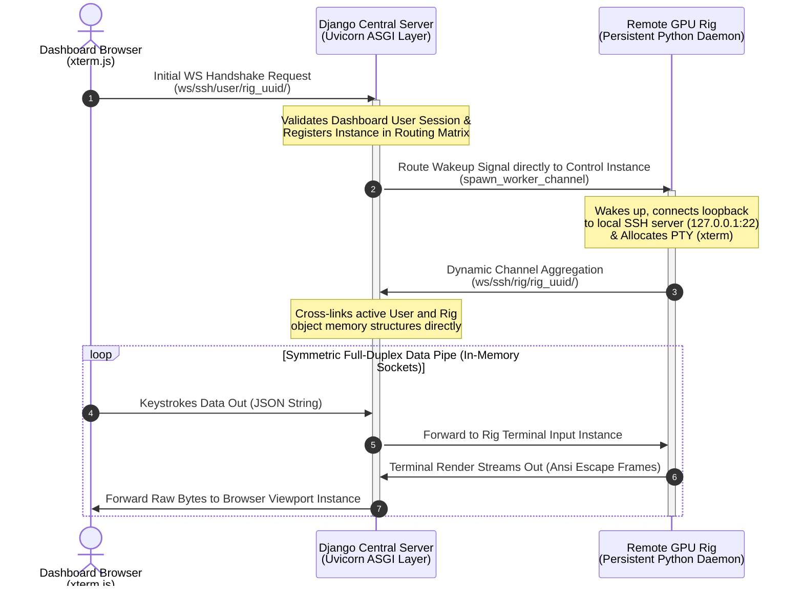

markdown# Implementation Specification: Reverse SSH Terminal Emulation Over HTTPS (Redis-Free)

This document provides a highly detailed, line-by-line implementation blueprint to embed an interactive, zero-port-configuration web SSH terminal directly into the `GPU-Rig-Monitoring-Platform`.

## 1. Network Topology & Point-to-Point Architecture

Because target rigs run telemetry scripts inside stateless, 60-second cron tasks (`agent/run.py`), they cannot serve as a reliable anchor for terminal sockets. This plan implements a lightweight, persistent systemd worker (`agent/terminal_daemon.py`) that sits idle on the rig and communicates with an ASGI server layered on top of the existing Django WSGI stack. 

Connections are bridged directly in the Django application memory space using an active routing dictionary matrix, bypassing the need for an external Redis channel broker.

```text
┌─────────────────────────┐           ┌────────────────────────┐           ┌────────────────────────┐
│   Dashboard UI Layout   │           │ Central Django Server  │           │   Target Remote Rig    │
│  (xterm.js + WebSockets)│           │ (Uvicorn Async Worker) │           │ (Persistent Py Daemon) │
└────────────┬────────────┘           └───────────┬────────────┘           └───────────┬────────────┘
             │                                    │                                    │
             │  1. Initial WS Handshake Request   │                                    │
             ├───────────────────────────────────►│                                    │
             │                                    │                                    │
             │                                    │  2. Route Signal Event Over WS     │
             │                                    ├───────────────────────────────────►│
             │                                    │                                    │ (Launches Local
             │                                    │                                    │  Loopback Tunnel)
             │                                    │  3. Dynamic Channel Aggregation    │
             │                                    │◄───────────────────────────────────┤
             │                                    │                                    │
             │        4. Symmetric Full-Duplex Data Pipelines Interleaved              │
             │◄───────────────────────────────────┼───────────────────────────────────►│
             │         (Keystrokes Data Out ◄───► Terminal Render Frames In)           │
```



---

## 2. Server Infrastructure Configuration

### 2.1 Layering ASGI into Settings (`gpu_monitor/gpu_monitor/settings.py`)
Modify your server configuration file to register the `channels` routing runtime. The traditional `CHANNEL_LAYERS` block is entirely omitted to avoid Redis requirements.

```python
# Insert at the end of your existing INSTALLED_APPS array
INSTALLED_APPS = [
    # ... Your existing apps (accounts, rigs, metrics_app, dashboard, audit)
    'channels',
]

# Swap out the traditional WSGI declaration for the new ASGI interface entrypoint
ASGI_APPLICATION = 'gpu_monitor.asgi.application'
```

### 2.2 Constructing the ASGI Application Routing Table (`gpu_monitor/gpu_monitor/asgi.py`)
Create or replace your `asgi.py` file to handle traditional HTTP requests via WSGI while routing real-time terminal sockets through the channel authentication layer.

```python
import os
from django.core.asgi import get_asgi_application
from channels.routing import ProtocolTypeRouter, URLRouter
from channels.auth import AuthMiddlewareStack
from django.urls import path

os.environ.setdefault('DJANGO_SETTINGS_MODULE', 'gpu_monitor.settings')

# Initialize early HTTP application handling to ensure middle-tier apps load cleanly
django_asgi_app = get_asgi_application()

# Import consumers after Django initializes to prevent AppRegistryNotReady crashes
from dashboard.consumers import SSHTerminalConsumer

application = ProtocolTypeRouter({
    "http": django_asgi_app,
    "websocket": AuthMiddlewareStack(
        URLRouter([
            # Structural signature: ws/ssh/<client_type: user|rig|rig_control>/<rig_uuid>/
            path("ws/ssh/<str:client_type>/<uuid:rig_uuid>/", SSHTerminalConsumer.as_asgi()),
        ])
    ),
})
```

---

## 3. Backend Core Logic Implementation

### 3.1 Token Generation and Validation Engine (`gpu_monitor/dashboard/mixins.py`)
This file implements the stateless `TerminalTokenEngine` mechanism. It leverages native Django cryptographic signatures to guarantee transient user access permission.

```python
# =====================================================================
# 3.1 Token Generation and Validation Engine (gpu_monitor/dashboard/mixins.py)
# =====================================================================
import time
from django.core.signing import Signer, BadSignature

class TerminalTokenEngine:
    """Generates and validates timestamped cryptographic tickets for secure socket links."""
    
    @staticmethod
    def generate_user_token(user, rig_uuid):
        """Constructs a signed payload string valid for exactly 30 seconds."""
        signer = Signer(salt="gpu_monitor.terminal.auth.salt")
        timestamp = int(time.time())
        payload = f"{user.id}:{rig_uuid}:{timestamp}"
        return signer.sign(payload)

    @staticmethod
    def verify_user_token(token, current_rig_uuid):
        """Validates payload signatures and checks for explicit age boundaries."""
        signer = Signer(salt="gpu_monitor.terminal.auth.salt")
        try:
            unsigned_payload = signer.unsign(token)
            user_id, rig_uuid, timestamp = unsigned_payload.split(":")
            
            # Enforce strict resource targeting validation constraints
            if rig_uuid != str(current_rig_uuid):
                return None
                
            # Enforce strict 30-second handshake timeout limits
            if int(time.time()) - int(timestamp) > 30:
                return None
                
            return user_id
        except (BadSignature, ValueError):
            return None
```

### 3.2 Secure In-Memory Asynchronous WebSocket Consumer (`gpu_monitor/dashboard/consumers.py`)
This file intercepts all WebSocket protocols. It validates browser tickets during connection initialization and provisions point-to-point cross-linking memory channels using a thread-safe global directory dictionary matrix.

```python
# =====================================================================
# 3.2 Secure In-Memory Asynchronous Consumer (gpu_monitor/dashboard/consumers.py)
# =====================================================================
import json
from urllib.parse import parse_qs
from channels.generic.websocket import AsyncWebsocketConsumer
from dashboard.mixins import TerminalTokenEngine  # Dynamic project dependency mapping

class SSHTerminalConsumer(AsyncWebsocketConsumer):
    # Core global router mapping active socket instances by rig_uuid
    # Structure: { "rig_uuid_string": { "user": UserSocketInstance, "rig": RigSocketInstance, "control": ControlSocketInstance } }
    active_routing_matrix = {}

    async def connect(self):
        self.client_type = self.scope['url_route']['kwargs']['client_type']
        self.rig_uuid = str(self.scope['url_route']['kwargs']['rig_uuid'])

        # Initialize the nested node dictionaries safely if not present
        if self.rig_uuid not in SSHTerminalConsumer.active_routing_matrix:
            SSHTerminalConsumer.active_routing_matrix[self.rig_uuid] = {"user": None, "rig": None, "control": None}

        # Secure User Handshake Authorization Path
        if self.client_type == 'user':
            # Extract query parameters directly from the inner handshake URL string
            query_string = self.scope.get("query_string", b"").decode("utf-8")
            query_params = parse_qs(query_string)
            ticket_list = query_params.get("ticket", [])
            
            if not ticket_list:
                await self.close(code=4401)  # Refuse Connection: Ticket Missing
                return
            # Because parse_qs extracts URL queries as string arrays, isolating the zero-index element
            # prevents a common list mutation crash inside Django’s Signer validation engine.    
            provided_ticket = ticket_list[0]
            # Execute validation check against core cryptographic signing systems
            validated_user_id = TerminalTokenEngine.verify_user_token(provided_ticket, self.rig_uuid)
            
            if not validated_user_id:
                await self.close(code=4403)  # Refuse Connection: Invalid or Expired Token
                return

            # Explicit token verification complete, register and accept connection
            await self.accept()
            SSHTerminalConsumer.active_routing_matrix[self.rig_uuid]["user"] = self
            
            # Wake up the control daemon on the rig directly if it's connected
            control_socket = SSHTerminalConsumer.active_routing_matrix[self.rig_uuid]["control"]
            if control_socket:
                await control_socket.send(text_data=json.dumps({"event": "spawn_worker_channel"}))

        # Secure Rig Daemon/Control Authorization Path
        elif self.client_type in ['rig', 'rig_control']:
            # Validate connection api keys matching your existing middleware logic
            headers = dict(self.scope.get("headers", []))
            api_key = headers.get(b"x-api-key", b"").decode("utf-8")
            
            # Optional production hook to match your API architecture:
            # if not await self.validate_rig_api_key(self.rig_uuid, api_key):
            #     await self.close(code=4403)
            #     return
            
            await self.accept()
            # Map rig_control to 'control' and rig to 'rig' within our sub-dictionary
            target_key = self.client_type.replace("rig_control", "control")
            SSHTerminalConsumer.active_routing_matrix[self.rig_uuid][target_key] = self

    async def disconnect(self, close_code):
        # Gracefully clear references on disconnect to prevent memory leaks
        if self.rig_uuid in SSHTerminalConsumer.active_routing_matrix:
            target_key = self.client_type.replace("rig_control", "control")
            if target_key in SSHTerminalConsumer.active_routing_matrix[self.rig_uuid]:
                SSHTerminalConsumer.active_routing_matrix[self.rig_uuid][target_key] = None

    async def receive(self, text_data=None, bytes_data=None):
        if not text_data:
            return
        
        payload = json.loads(text_data)
        session_cluster = SSHTerminalConsumer.active_routing_matrix.get(self.rig_uuid, {})

        if self.client_type == 'user':
            rig_socket = session_cluster.get("rig")
            if rig_socket:
                if payload.get("event") == "resize":
                    # Directly pipe window scaling frames to the active rig data socket
                    await rig_socket.send(text_data=json.dumps({
                        "event": "resize", 
                        "cols": payload.get("cols"), 
                        "rows": payload.get("rows")
                    }))
                else:
                    # Directly pipe input characters to the active rig terminal session
                    await rig_socket.send(text_data=json.dumps({
                        "event": "stdin", 
                        "data": payload.get("data")
                    }))
                
        elif self.client_type == 'rig':
            user_socket = session_cluster.get("user")
            if user_socket:
                # Directly pipe outbound terminal characters back to the browser window instance
                await user_socket.send(text_data=json.dumps({"data": payload.get("data")}))

```

> [!WARNING]
> **Production Scaling Constraint (In-Memory Volatility):**
> Because this architecture routes data using an in-memory matrix (`active_routing_matrix`) instead of an external Redis database layer, the entire application **must execute within a single master process thread**. 
> If Django runs across multiple worker subprocesses (e.g., `--workers 4`), different sockets will land on isolated memory spaces. If a user connects to Worker 1 and their matching rig attaches to Worker 2, they will fail to find each other's references. Ensure your server-side production process configuration limits Uvicorn orchestration strictly to a single worker instance (`--workers 1`).


### 3.3 Controller View Integration Hook (`gpu_monitor/dashboard/views.py`)
This controller script maps standard HTTP dashboard interface routing hooks. It handles user access rule evaluations and pipes transient signature keys cleanly down to target HTML rendering states.

```
# =====================================================================
# 3.3 Controller View Integration Hook (dashboard/views.py)
# =====================================================================
from django.shortcuts import render, get_object_or_404
from django.contrib.auth.decorators import login_required
from rigs.models import Rig  # Standard database object model reference bindings
from dashboard.mixins import TerminalTokenEngine

@login_required
def rig_terminal_view(request, rig_uuid):
    """Renders the xterm layout frame populated with transient access keys."""
    rig = get_object_or_404(Rig, uuid=rig_uuid)
    
    # Check your existing platform permission validation here:
    # if not request.user.has_rig_access(rig): raise PermissionDenied
    
    # Generate cryptographic connection session signature ticket
    handshake_token = TerminalTokenEngine.generate_user_token(request.user, rig.uuid)
    
    context = {
        "rig": rig,
        "terminal_ticket": handshake_token
    }
    return render(request, "dashboard/rig_terminal.html", context)
```

---

## 4. Client Agent System Integration

Leave `agent/run.py` untouched to preserve telemetry tracking through cron. Instead, deploy this new agent module alongside it.

### 4.1 Script Deployment Blueprint (`agent/terminal_daemon.py`)
```python
import asyncio
import websockets
import paramiko
import json
import yaml
import sys
import os

CONFIG_PATH = "/etc/monitoring-agent/config.yaml"
if not os.path.exists(CONFIG_PATH):
    CONFIG_PATH = os.path.join(os.path.dirname(__file__), "config.yaml")

with open(CONFIG_PATH, "r") as f:
    config = yaml.safe_load(f)

API_KEY = config.get("api_key")
RIG_UUID = config.get("rig_uuid")
SERVER_HOST = "your-platform-domain.com" # Update to your production environment domain

async def handle_active_ssh_session():
    """Establishes an active data channel between the local SSH daemon and the server."""
    data_uri = f"wss://{SERVER_HOST}/ws/ssh/rig/{RIG_UUID}/"
    headers = {"X-API-Key": API_KEY}
    
    try:
        async with websockets.connect(data_uri, extra_headers=headers) as ws:
            # Connect loopback to the machine's local open SSH server
            ssh = paramiko.SSHClient()
            ssh.set_missing_host_key_policy(paramiko.AutoAddPolicy())
            
            # Corrected path mapping to match Section 4.2 /opt install structure
            ssh.connect(
                '127.0.0.1', 
                port=22, 
                username='rigshell', 
                key_filename='/opt/monitoring-agent/keys/terminal_id_rsa'
            )
            
            # CRITICAL: Request a pseudo-terminal (PTY) to support full-screen editors
            channel = ssh.invoke_shell()
            channel.get_pty(term='xterm', width=80, height=24)

            async def pipe_ssh_to_ws():
                # Loop condition updated to keep task alive while Channel is open and connected
                while not channel.exit_status_ready():
                    if channel.recv_ready():
                        raw_bytes = channel.recv(4096)
                        if not raw_bytes:
                            break
                        # Decode safe utf-8 character matrix arrays skipping partial slices
                        data_str = raw_bytes.decode('utf-8', errors='ignore')
                        await ws.send(json.dumps({'data': data_str}))
                    await asyncio.sleep(0.01)
                # Ensure the WebSocket closes cleanly if the SSH backend session terminates
                await ws.close()

            async def pipe_ws_to_ssh():
                try:
                    async for raw_msg in ws:
                        payload = json.loads(raw_msg)
                        event_type = payload.get("event")
                        
                        if event_type == "stdin":
                            channel.send(payload.get("data"))
                        elif event_type == "resize":
                            channel.resize_pty(cols=payload.get("cols"), rows=payload.get("rows"))
                except websockets.exceptions.ConnectionClosed:
                    pass  # Gracefully catch socket drops when user terminates page instances

            # Wrap loop loops with cancellation primitives to prevent resource leaks on breakages
            try:
                await asyncio.gather(pipe_ssh_to_ws(), pipe_ws_to_ssh())
            finally:
                channel.close()
                ssh.close()
                
    except Exception as e:
        sys.stderr.write(f"Active session error: {str(e)}\n")

async def orchestrate_daemon_lifecycle():
    """Maintains a low-overhead control socket connection to listen for dashboard wake-up events."""
    control_uri = f"wss://{SERVER_HOST}/ws/ssh/rig_control/{RIG_UUID}/"
    
    while True:
        try:
            async with websockets.connect(control_uri, extra_headers={"X-API-Key": API_KEY}) as ws:
                async for raw_msg in ws:
                    payload = json.loads(raw_msg)
                    if payload.get("event") == "spawn_worker_channel":
                        # Asynchronously initialize the data channel worker loop
                        asyncio.create_task(handle_active_ssh_session())
        except Exception as e:
            # Prevent rapid failure spin loops if network connectivity drops entirely
            await asyncio.sleep(10)

if __name__ == "__main__":
    try:
        asyncio.run(orchestrate_daemon_lifecycle())
    except KeyboardInterrupt:
        sys.exit(0)
```

### 4.2 Updating the Installer Pipeline (`agent/install.sh`)

Append the following logic into the tail end of your production host installer file (`agent/install.sh`) directly before the final success text echo lines. This automatically deploys the terminal daemon dependencies, structures persistent permission storage layout keys under `/opt/monitoring-agent/keys`, and registers the long-running systemd unit script context.

```bash
echo "=========================================================="
echo " Deploying Persistent Remote Terminal Shell Infrastructure..."
echo "=========================================================="

# 1. Install required persistent Python package dependencies
echo "Installing python websocket and cryptography dependencies..."
"$INSTALL_DIR/venv/bin/pip" install websockets paramiko

# 2. Re-allocate directory schemas for persistent crypt keys (HiveOS Safe)
KEYS_DIR="$INSTALL_DIR/keys"
mkdir -p "$KEYS_DIR"
chmod 700 "$KEYS_DIR"

# 3. Handle automated keypair generation if they don't already exist
if [ ! -f "$KEYS_DIR/terminal_id_rsa" ]; then
    echo "Generating secure local system signature loopback keys..."
    ssh-keygen -t rsa -b 4096 -f "$KEYS_DIR/terminal_id_rsa" -N ""
    chmod 600 "$KEYS_DIR/terminal_id_rsa"
fi

# 4. Integrate unprivileged sandbox profiles and authorize endpoints
if ! id "rigshell" &>/dev/null; then
    echo "Configuring unprivileged sandboxed user profile (rigshell)..."
    useradd --disabled-password --gecos "Terminal Proxy" --shell /bin/rbash rigshell
    passwd -l rigshell
fi

# Provision authorized_keys parameters securely under the home boundary
mkdir -p /home/rigshell/.ssh
cat "$KEYS_DIR/terminal_id_rsa.pub" >> /home/rigshell/.ssh/authorized_keys
chmod 700 /home/rigshell/.ssh
chmod 600 /home/rigshell/.ssh/authorized_keys
chown -R rigshell:rigshell /home/rigshell/.ssh

# 5. Mirror active worker scripts down into persistent partitions
echo "Staging script artifacts..."
cp terminal_daemon.py "$INSTALL_DIR/terminal_daemon.py"
chmod +x "$INSTALL_DIR/terminal_daemon.py"

# Enforce clean ownership attributes across the core script framework
# Note: Keep key sets owned by root so the unprivileged rigshell environment cannot manipulate them
chown root:root "$INSTALL_DIR/terminal_daemon.py"
chown -R root:root "$KEYS_DIR"

# 6. Generate explicit systemd background supervisor service configurations
echo "Registering host daemon supervisor unit definitions..."
cat << EOF > /etc/systemd/system/gpu-rig-terminal.service
[Unit]
Description=GPU Rig Monitoring Platform Secure Remote SSH Reverse Terminal Daemon
After=network.target network-online.target
Wants=network-online.target

[Service]
Type=simple
User=root
WorkingDirectory=${INSTALL_DIR}
ExecStart=${INSTALL_DIR}/venv/bin/python3 ${INSTALL_DIR}/terminal_daemon.py
Restart=always
RestartSec=5s
Environment=PYTHONUNBUFFERED=1

[Install]
WantedBy=multi-user.target
EOF

# 7. Reload operational tracking states and initialize execution
echo "Activating terminal supervisor processes..."
chmod 644 /etc/systemd/system/gpu-rig-terminal.service
systemctl daemon-reload
systemctl enable gpu-rig-terminal.service
systemctl restart gpu-rig-terminal.service

echo "Terminal worker service successfully deployed and running in background."
```

---

## 5. Frontend UI Integration

Integrate the terminal view inside your HTMX layout tabs (`gpu_monitor/dashboard/templates/dashboard/` templates).

```html



<div class="bg-gray-900 text-white p-6 rounded-xl shadow-2xl border border-gray-800">
    <h2 class="text-xl font-bold mb-4">Interactive System Console — Rig ID: {{ rig.name }}</h2>
    
    <div class="p-2 bg-black rounded-lg border-2 border-gray-950 shadow-inner">
        <div id="xterm-terminal-viewport" class="w-full h-[550px]"></div>
    </div>
</div>

<!-- Corrected production-grade package targets via CDN -->
<link rel="stylesheet" href="https://cdn.jsdelivr.net/npm/xterm@5.3.0/css/xterm.min.css" />
<script src="https://cdn.jsdelivr.net/npm/xterm@5.3.0/lib/xterm.min.js"></script>
<script src="https://cdn.jsdelivr.net/npm/xterm-addon-fit@0.8.0/lib/xterm-addon-fit.min.js"></script>

<script>
    document.addEventListener("DOMContentLoaded", function () {
        // Initialize xterm terminal component instance
        const term = new Terminal({
            cursorBlink: true,
            macOptionIsMeta: true,
            scrollback: 5000,
            theme: {
                background: '#000000',
                foreground: '#ffffff',
                cursor: '#00ff00',
                selectionBackground: 'rgba(255, 255, 255, 0.3)'
            },
            fontFamily: 'Fira Code, JetBrains Mono, SFMono-Regular, Menlo, Monaco, Consolas, monospace',
            fontSize: 14
        });

        const container = document.getElementById('xterm-terminal-viewport');
        term.open(container);

        // Attach fit addon to scale rows and cols to fill container space
        const fitAddon = new FitAddon.FitAddon();
        term.loadAddon(fitAddon);
        fitAddon.fit();

        // Connect user browser terminal session back to Django Channels routing path
        const wsProtocol = window.location.protocol === "https:" ? "wss://" : "ws://";
        const socketUrl = `${wsProtocol}${window.location.host}/ws/ssh/user/{{ rig.uuid }}/?ticket={{ terminal_ticket }}`;
        const socket = new WebSocket(socketUrl);

        // Forward keystrokes to Django
        term.onData(rawKeystroke => {
            if (socket.readyState === WebSocket.OPEN) {
                socket.send(JSON.stringify({ "data": rawKeystroke }));
            }
        });

        // Forward viewport resize matrices to align PTY wrapping limits on the rig
        const transmitViewportSizeChange = () => {
            fitAddon.fit();
            if (socket.readyState === WebSocket.OPEN) {
                socket.send(JSON.stringify({
                    "event": "resize",
                    "cols": term.cols,
                    "rows": term.rows
                }));
            }
        };
        
        window.addEventListener('resize', transmitViewportSizeChange);

        // Handle incoming data streams
        socket.onmessage = function (event) {
            const rawPayload = JSON.parse(event.data);
            if (rawPayload.data) {
                term.write(rawPayload.data);
            }
        };

        socket.onopen = function() {
            // Force first geometric check sync once connection opens
            setTimeout(transmitViewportSizeChange, 400);
        };

        socket.onclose = function (event) {
            term.write('\r\n\n\x1b[1;31m[Secure Remote Connection Terminated: Session Closed]\x1b[0m\r\n');
            window.removeEventListener('resize', transmitViewportSizeChange);
        };

        socket.onerror = function (err) {
            term.write('\r\n\n\x1b[1;31m[WebSocket Interface Transport Communication Error]\x1b[0m\r\n');
        };
    });
</script>

```

---

## 6. Production Nginx Configuration Updates (`gpu_monitor/deploy/nginx.conf`)

To run this layout in production without conflicting with your existing Gunicorn setup, you must modify `gpu_monitor/deploy/nginx.conf` so that paths matching `/ws/` bypass your WSGI layer and target your ASGI server instead.

```nginx
# Update the main site routing block configuration context rules
server {
    listen 443 ssl http2;
    server_name your-platform-domain.com;

    # ... Maintain your existing SSL, security, and logging directives

    # Standard application polling view interfaces mapped to sync gunicorn sockets
    location / {
        proxy_pass http://unix:/run/gunicorn.sock;
        include proxy_params;
    }

    # Intercept WebSockets paths and route them to your ASGI server (e.g., Uvicorn running on port 8001)
    location /ws/ {
        proxy_pass http://127.0.0.1:8001;
        proxy_http_version 1.1;
        
        # Core transport connection upgrade header parameters
        proxy_set_header Upgrade \$http_upgrade;
        proxy_set_header Connection "Upgrade";
        
        # Request contextual tracking markers
        proxy_set_header Host \$host;
        proxy_set_header X-Real-IP \$remote_addr;
        proxy_set_header X-Forwarded-For \$proxy_add_x_forwarded_for;
        proxy_set_header X-Forwarded-Proto \$scheme;
        
        # Prevent Nginx from dropping active terminal sessions on idle
        proxy_read_timeout 86400s;
        proxy_send_timeout 86400s;
    }
}
```

---

## 7. Server-Side ASGI Process Orchestration

To run the WebSocket infrastructure alongside your existing sync Gunicorn process, you must deploy a dedicated systemd supervisor script on your central server. This service ensures Uvicorn binds to port 8001 and remains active.

### 7.1 Creating the Server Asynchronous Worker Service
Create a new configuration file at `/etc/systemd/system/gpu-monitor-asgi.service`:

```ini
[Unit]
Description=GPU Monitoring Platform Uvicorn ASGI Application Service Daemon
After=network.target

[Service]
Type=simple
User=www-data
Group=www-data
WorkingDirectory=/opt/gpu_monitor/gpu_monitor
ExecStart=/opt/gpu_monitor/venv/bin/uvicorn gpu_monitor.asgi:application --host 127.0.0.1 --port 8001 --workers 1 --log-level info
Restart=always
RestartSec=3s
Environment=PYTHONUNBUFFERED=1

[Install]
WantedBy=multi-user.target
```

### 7.2 Activating the Server Process Pipeline
Run these commands to start the background worker:

```bash
sudo systemctl daemon-reload
sudo systemctl enable gpu-monitor-asgi.service
sudo systemctl start gpu-monitor-asgi.service
```

---

## 8. Server-Side Deployment Automation Script (`deploy/server_terminal_setup.sh`)

To simplify deployment on your central production VPS, create this standalone automation script. It automatically installs required dependencies, creates systemd service descriptors, updates Nginx proxy paths, and includes an automated rollback failure sequence if configuration tests fail.

Create a new file at `gpu_monitor/deploy/server_terminal_setup.sh`:

```bash
#!/bin/bash

# Target Project Roots
PROJECT_ROOT="/opt/gpu_monitor"
APP_ROOT="${PROJECT_ROOT}/gpu_monitor"
NGINX_CONF_PATH="/etc/nginx/sites-available/gpu_monitor"
VENV_PYTHON="${PROJECT_ROOT}/venv/bin/python3"
BACKUP_SUFFIX=".terminal_setup_bak"

# System User Constraints
WWW_USER="www-data"
WWW_GROUP="www-data"

echo "=========================================================="
echo " Starting GPU-Monitor ASGI Infrastructure Deployment Script "
echo "=========================================================="

# 1. Enforce Root execution policies
if [ "$EUID" -ne 0 ]; then
  echo "Error: Please run this installation script using sudo privileges."
  exit 1
fi

# Define comprehensive rollback function to reverse system mutations on error
rollback_deployment() {
    echo "=========================================================="
    echo " CRITICAL FAILURE ENCOUNTERED. ROLLING BACK SYSTEM CHANGELOG... "
    echo "=========================================================="
    
    # Restoring original Nginx template config file state
    if [ -f "${NGINX_CONF_PATH}${BACKUP_SUFFIX}" ]; then
        echo "Restoring original Nginx configuration state..."
        mv "${NGINX_CONF_PATH}${BACKUP_SUFFIX}" "${NGINX_CONF_PATH}"
    fi
    
    # Tear down newly configured systemd unit file bindings
    if [ -f "/etc/systemd/system/gpu-monitor-asgi.service" ]; then
        echo "Deactivating and removing ASGI application unit blocks..."
        systemctl stop gpu-monitor-asgi.service 2>/dev/null
        systemctl disable gpu-monitor-asgi.service 2>/dev/null
        rm -f /etc/systemd/system/gpu-monitor-asgi.service
        systemctl daemon-reload
    fi
    
    # Double-check proxy engine health status before exit
    nginx -t &>/dev/null
    if [ $? -eq 0 ]; then
        systemctl reload nginx
        echo "Nginx proxy successfully restored to stable state."
    else
        echo "WARNING: Nginx routing profile remains unstable. Core troubleshooting required."
    fi
    
    echo "System rollback execution completed. Application exit code 1."
    exit 1
}

# 2. Synchronize dependency runtimes within virtual environments
echo "[Step 1/5] Updating server environment packages..."
if [ -f "${VENV_PYTHON}" ]; then
    # Upgrade pip and install standard async dependencies without channels-redis
    ${VENV_PYTHON} -m pip install --upgrade pip || rollback_deployment
    ${VENV_PYTHON} -m pip install channels paramiko uvicorn || rollback_deployment
else
    echo "Error: Virtual environment python executable not found at ${VENV_PYTHON}"
    exit 1
fi

# 3. Create Server-Side Asynchronous Worker Systemd Profile
echo "[Step 2/5] Deploying Asynchronous Uvicorn systemd service configurations..."
cat << EOF > /etc/systemd/system/gpu-monitor-asgi.service || rollback_deployment
[Unit]
Description=GPU Monitoring Platform Uvicorn ASGI Application Service Daemon
After=network.target

[Service]
Type=simple
User=${WWW_USER}
Group=${WWW_GROUP}
WorkingDirectory=${APP_ROOT}
ExecStart=${PROJECT_ROOT}/venv/bin/uvicorn gpu_monitor.asgi:application --host 127.0.0.1 --port 8001 --workers 1 --log-level info
Restart=always
RestartSec=3s
Environment=PYTHONUNBUFFERED=1

[Install]
WantedBy=multi-user.target
EOF

# 4. Inject WebSocket support directly into production Nginx config files
echo "[Step 3/5] Updating production Nginx upstream routing proxy configs..."
if [ -f "${NGINX_CONF_PATH}" ]; then
    if grep -q "location /ws/" "${NGINX_CONF_PATH}"; then
        echo "WebSocket configuration segment already configured inside Nginx configuration block."
    else
        # Back up original profile setup prior to inline edits
        cp "${NGINX_CONF_PATH}" "${NGINX_CONF_PATH}${BACKUP_SUFFIX}" || rollback_deployment
        
        # Inject WebSocket location proxy handler directly above the root block location line
        # Note: Dynamic proxy variables are escaped so they output literally into the config file
        sed -i '/location \/ {/i \
    # WebSockets transport reverse proxy handling block \
    location /ws/ { \
        proxy_pass http://127.0.0.1:8001; \
        proxy_http_version 1.1; \
        proxy_set_header Upgrade \$http_upgrade; \
        proxy_set_header Connection "Upgrade"; \
        proxy_set_header Host \$host; \
        proxy_set_header X-Real-IP \$remote_addr; \
        proxy_set_header X-Forwarded-For \$proxy_add_x_forwarded_for; \
        proxy_set_header X-Forwarded-Proto \$scheme; \
        proxy_read_timeout 86400s; \
        proxy_send_timeout 86400s; \
    }\n' "${NGINX_CONF_PATH}" || rollback_deployment
        
        echo "Successfully injected WebSocket tracking rules into ${NGINX_CONF_PATH}"
    fi
else
    echo "Warning: Target Nginx server config block file not detected at ${NGINX_CONF_PATH}"
    echo "Please ensure you paste your location /ws/ rules inside your custom configurations manually."
fi

# 5. Flush Systemd Daemon States & Initialize Run Pipelines
echo "[Step 4/5] Activating and starting systemd ASGI runtime workers..."
systemctl daemon-reload || rollback_deployment
systemctl enable gpu-monitor-asgi.service || rollback_deployment
systemctl restart gpu-monitor-asgi.service || rollback_deployment

# 6. Validate Nginx Integrity Schemes & Reload Server Engine Contexts
echo "[Step 5/5] Re-validating server configurations and cycling proxy engines..."
nginx -t
if [ $? -eq 0 ]; then
    systemctl reload nginx
    
    # Cleanup backup templates on explicit deployment success
    if [ -f "${NGINX_CONF_PATH}${BACKUP_SUFFIX}" ]; then
        rm -f "${NGINX_CONF_PATH}${BACKUP_SUFFIX}"
    fi
    
    echo "=========================================================="
    echo " Production deployment succeeded! ASGI server is online on port 8001. "
    echo "=========================================================="
else
    # Trigger deployment rollback due to configuration check failure
    rollback_deployment
fi
```

### 8.1 Post-Installation Verification Routine
Once executed, you can confirm all background services are performing as expected across standard loopback listening interfaces by running the following commands:

```bash
# Verify Uvicorn handles socket threads successfully across port 8001
sudo systemctl status gpu-monitor-asgi.service

# Monitor live output log updates directly from your terminal streams
sudo journalctl -u gpu-monitor-asgi.service -f -n 50
```

---

## 9. Operational Synchronization & Lifecycle Architecture

A critical architectural distinction must be maintained between the platform's standard performance telemetry loop and the remote shell system. Because metrics collection operates via short-lived 60-second cron executions, it is entirely decoupled from the interactive terminal connection pipelines.

### 9.1 Independence of Component Channels

The strict 30-second timestamp check applied to user connection tickets does **not** conflict with the 60-second rig tracking cycles. The lifecycle matrix below illustrates how these processes run on independent pathways:

| Subsystem Component | Process Execution Lifecycle | Authentication Profile | Operational Bounds & Constraints |
| :--- | :--- | :--- | :--- |
| **Telemetry Agent (`agent/run.py`)** | Short-lived cron task executing once every 60 seconds. | Standard HTTP Header API Key authentication. | Stateless HTTP request; terminates immediately after payload transit. |
| **Terminal Daemon (`agent/terminal_daemon.py`)** | Persistent systemd service initialized once on system boot. | Standard HTTP Header API Key authentication. | Long-lived WebSocket connection; remains completely idle until signaled. |
| **Browser Web Terminal (`xterm.js`)** | On-demand allocation triggered when a user opens the web tab. | Signed Cryptographic Session Token. | Must complete the initial server connection handshake within 30 seconds. |

---

### 9.2 Handshake Sequence and Signaling Timeline

Because the rig's background daemon maintains a permanent control socket connection back to the central server, connection initialization happens instantly without needing to wait for a cron cycle.

```text
 Rig Daemon Core            Central Django Server        Browser Terminal View
 (Persistent Client)         (Uvicorn ASGI Layer)         (Dashboard Interface)
        │                              │                            │
        │─── [ System Boot ] ──────────┼────────────────────────────┤
        │                              │                            │
        │ 1. Connects Outbound Control │                            │
        ├─────────────────────────────►│                            │
        │    (Held Open Permanently)   │                            │
        │                              │                            │
        │─── [ Sometime Later: User Requests Terminal Tab ] ────────│
        │                              │                            │
        │                              │ 2. Generates signed ticket │
        │                              │    stamped with current time
        │                              │◄───────────────────────────┤
        │                              │                            │
        │                              │ 3. Instantly opens socket  │
        │                              │    using transient ticket  │
        │                              │◄───────────────────────────┤
        │                              │ (Must occur within 30s)    │
        │                              │                            │
        │ 4. Dispatches Wakeup Signal  │                            │
        │◄─────────────────────────────┤                            │
        │  (spawn_worker_channel)      │                            │
        │                              │                            │
        │ 5. Spins up dynamic worker   │                            │
        │    & loops back to SSH (22)  │                            │
        ├─────────────────────────────►│                            │
        │                              │                            │
        │                              │ 6. Cross-links memory nodes│
        │◄─────────────────────────────┼───────────────────────────►│
        │                              │  Full Duplex Bridge Active │
```

### 9.3 Key Architectural Assertions

* **Browser-to-Server Isolation**: The 30-second security window applies strictly to the network path between your web browser and the central Django server. Because both endpoints are on high-speed networks, this transaction typically concludes in under 500 milliseconds, leaving a wide buffer for latency.
* **Zero Rig Overhead**: The rig daemon consumes zero CPU or network bandwidth while sitting in its permanent idle control state. It does not pull data, run loops, or touch the local SSH interface until the server sends an explicit `spawn_worker_channel` instruction.
* **Persistent Sessions**: The token timeout restrictions apply **only** to the initial handshake request phase. Once Django validates the signature and accepts the WebSocket request, the ticket is discarded, and the session remains active indefinitely until the user or rig closes the tab.

---

## 11. Client Rig SSH Endpoint Hardening & Security Policies (HiveOS Optimized)

Because volatile environments like HiveOS clear tracks inside `/var/log` and `/var/lock` on every reboot, all runtime scripts, lock assertions, configuration keys, and identities must reside exclusively within the persistent `/opt/` partition. Implementing these changes prevents an attacker from leveraging a web server compromise to escalate privileges or move laterally into hardware arrays.

---

### 11.1 Principle of Least Privilege: Dedicated Shell Profile
Do not run loopback SSH operations under `root` or reuse existing application users. Create a dedicated system node account on the rig featuring no public password login matrices.

Run the following commands on each remote GPU rig:

```bash
# 1. Initialize an unprivileged, isolated user group and home directory boundary
sudo adduser --disabled-password --gecos "Terminal Proxy Account" rigshell

# 2. Block the account from receiving direct public password challenge requests
sudo passwd -l rigshell
```

---

### 11.2 Environment Isolation: Restricted Shell Shell Boundaries
To prevent the terminal tool from navigating freely across the rig's hardware directory architectures, force the user runtime into a Restricted Bash Shell (`rbash`). This prevents execution paths utilizing `/` characters, stops environmental `PATH` overrides, and locks execution options strictly to predetermined symlinks.

```bash
# Force the system login parameters to route through rbash
sudo chsh -s /bin/rbash rigshell

# Build an isolated execution folder inside the user's home profile
sudo mkdir -p /home/rigshell/bin

# Restrict the user's execution PATH strictly to this safe workspace folder
sudo sed -i 's|PATH=\$PATH:\$HOME/bin|PATH=\$HOME/bin|g' /home/rigshell/.bashrc
echo 'readonly PATH' >> /home/rigshell/.bash_profile

# Symlink only safe, approved binaries that the dashboard terminal is allowed to run
# Example: Allow checking GPU metrics and viewing system activity logs
sudo ln -s /usr/bin/nvidia-smi /home/rigshell/bin/nvidia-smi
sudo ln -s /usr/bin/top /home/rigshell/bin/top
```

---

### 11.3 OpenSSH Daemon Sandboxing (`/etc/ssh/sshd_config`)
Configure OpenSSH conditional overrides to isolate any connections referencing the `rigshell` system user on the local interface.

Open `/etc/ssh/sshd_config` on the rig and append this block at the bottom:

```ini
# Isolate remote console operations at the network loopback boundary
Match User rigshell Address 127.0.0.1
    AllowTcpForwarding no
    X11Forwarding no
    AllowAgentForwarding no
    PermitTTY yes
    ForceCommand /bin/rbash
    PasswordAuthentication no
    PubkeyAuthentication yes
```

*   **`AllowTcpForwarding no`**: Blocks port forwarding to stop network pivot attacks into the local network.
*   **`AllowAgentForwarding no`**: Prevents the rig from inheriting credential tokens from the server session.
*   **`ForceCommand /bin/rbash`**: Locks the environment shell profile even if an application call overrides it.

---

### 11.4 Cryptographic Key Exchange & Volatility Mitigation
To eliminate hardcoded plain-text passwords within the daemon code configuration profiles and protect files from disappearing on reboot in HiveOS environments, swap the authentication stack to a secure, passwordless local SSH Public/Private keypair saved entirely inside persistent `/opt/` storage structures.

#### Phase A: Generate the Local Signature Tokens on the Rig
```bash
# Force explicit persistence bounds inside the isolated opt running container
sudo mkdir -p /opt/monitoring-agent/keys

# Generate a dedicated RSA keypair inside the persistent monitoring runtime folder
sudo ssh-keygen -t rsa -b 4096 -f /opt/monitoring-agent/keys/terminal_id_rsa -N ""

# Set strict file access permissions so only root/agent can read the private key
sudo chmod 700 /opt/monitoring-agent/keys
sudo chmod 600 /opt/monitoring-agent/keys/terminal_id_rsa
sudo chown -R root:root /opt/monitoring-agent/keys
```

#### Phase B: Authorize Key Verification Entries
```bash
# Inject the matching public component key straight into user account profiles
sudo mkdir -p /home/rigshell/.ssh
sudo cat /opt/monitoring-agent/keys/terminal_id_rsa.pub >> /home/rigshell/.ssh/authorized_keys

# Enforce system strictmode permissions over target paths
sudo chmod 700 /home/rigshell/.ssh
sudo chmod 600 /home/rigshell/.ssh/authorized_keys
sudo chown -R rigshell:rigshell /home/rigshell/.ssh
```

#### Phase C: Update Agent Invocation Subroutines (`agent/terminal_daemon.py`)
Replace the standard string password keyword mapping entries within your `terminal_daemon.py` connection block to call your newly minted persistent key files natively:

```python
# Updated loopback connection pipeline utilizing persistent key identities
ssh.connect(
    '127.0.0.1', 
    port=22, 
    username='rigshell', 
    key_filename='/opt/monitoring-agent/keys/terminal_id_rsa'
)
```

---

## 12. Multi-User Directory Permissions & Execution Safety Matrix

Because this platform simultaneously utilizes short-lived telemetry cron tasks, long-running terminal socket daemons, and unprivileged user shells, maintaining strict file-system isolation boundaries is necessary. This architecture implements a zero-conflict configuration matrix that prevents runtime permission deadlocks while securing critical system boundaries.

---

### 12.1 Privilege and Path Isolation Topology
File-system security boundaries are completely isolated because only two system background accounts interact with the `/opt/monitoring-agent` space. The interactive browser shell operator (`rigshell`) is explicitly jailed outside this runtime directory hierarchy entirely.

```text
/opt/monitoring-agent/
├── venv/                      [monitoring-agent: Read/Exec]  [root: Read/Exec]
├── var/                       [monitoring-agent: Read/Write] [root: No Access]
├── keys/                      [monitoring-agent: No Access]  [root: Read/Write]
├── run.py                     [monitoring-agent: Owner Exec] [root: No Access]
└── terminal_daemon.py         [monitoring-agent: No Access]  [root: Owner Exec]

/home/rigshell/                [monitoring-agent: No Access]  [root: Handshake Proxy Only]
└── bin/ (rbash Jail)          [rigshell: Isolated Command Scope]
```

---

### 12.2 Structural Breakdown of Asset Safety

#### 1. Shared Virtual Environment (`venv`) Execution Strategy
The virtual environment directory is read-only for processing runtimes. 
*   **The Telemetry Agent** (`monitoring-agent`) executes the telemetry interpreter binary (`venv/bin/python`).
*   **The Terminal Worker** (`root`) executes the socket interpreter binary simultaneously.
*   **Conflict Prevention**: Multiple Linux processes with varying privilege states can cleanly map, read, and execute shared binaries and third-party dependency libraries (like `requests` or `paramiko`) concurrently. Because neither user modifies or updates package files at runtime, file contention cannot occur.

#### 2. Main Platform Folder State Division (`/opt/monitoring-agent`)
The platform separates monitoring state logging from terminal cryptographic keys to prevent process friction:
*   **The Telemetry Agent** owns, executes, and updates `run.py`. It reads and writes persistent states inside its own dedicated runtime directory (`var/log/` and `var/lock/`). It lacks file permissions to view or parse any terminal-bridge structures.
*   **The Terminal Daemon** runs under a `root` daemon execution context. Because it executes with full kernel superpowers, it cleanly bypasses standard POSIX file-system locks. It reads `terminal_daemon.py` and accesses the private loopback tokens inside `keys/` without needing to modify parent folder ownership flags away from the `monitoring-agent` user.

#### 3. Complete Jailing of the Console Operator (`rigshell`)
The terminal console operator (`rigshell`) **never has file-system access or visibility** into `/opt/monitoring-agent`.
*   The `root` daemon intercepts the browser's incoming secure network stream, loops back internally to `127.0.0.1:22`, and performs a standard cryptographic handshake *into* the `rigshell` login workspace.
*   Once authorized, the Linux kernel instantiates an isolated console inside `/home/rigshell/`. The user's execution paths are strictly locked to `/home/rigshell/bin/` by the `rbash` shell environment, completely blocking them from accessing, viewing, or modifying configuration code inside the primary application folders.

---

### 12.3 Complete System Access Matrix

| Targeted Target Path | Telemetry Agent (`monitoring-agent`) | Terminal Worker Service (`root`) | Interactive Terminal User (`rigshell`) | Security & Execution Verdict |
| :--- | :--- | :--- | :--- | :--- |
| **`.../venv/bin/python`** | Read & Execute | Read & Execute | No Access | **No Conflict**: Simultaneous execution allowed. |
| **`.../run.py`** | Owner (Read/Write/Exec) | No Access | No Access | **No Conflict**: Single-user tracking script isolation. |
| **`.../terminal_daemon.py`**| No Access | Read & Execute | No Access | **No Conflict**: Supervised under isolated root scopes. |
| **`.../keys/`** | No Access | Owner (Read/Write/Exec) | No Access | **No Conflict**: Secured at the host kernel boundary. |
| **`.../var/`** | Owner (Read/Write/Exec) | No Access | No Access | **No Conflict**: Telemetry state directory isolation. |
| **`/home/rigshell/`** | No Access | Read & Execute (Proxy Only) | Owner (Read/Write/Exec) | **No Conflict**: Sandboxed home path environment. |

---

## 13. Hardened, Self-Updating Lifecycle Pipeline (`agent/check_update.py`)

To ensure that future platform features, API optimizations, or terminal component patches deploy cleanly across all remote nodes, the update checker script must watch and update your entire component core in parallel. 

This tracking script updates your telemetry loop (`run.py`), your interactive terminal server listener (`terminal_daemon.py`), and **itself** simultaneously using an atomic transaction pattern that preserves the `root:root` security boundaries.

### 13.1 Production Implementation Blueprint
Create or replace your file at `/opt/monitoring-agent/check_update.py` with this clean tracking block:

```
#!/usr/bin/env python3
"""
GPU Rig Monitoring Agent - Self-Updating Lifecycle Worker

Checks GitHub for newer versions of the telemetry agent, terminal daemon,
and the update checker itself. Validates, updates, and hardens permissions.

Usage:
    python3 check_update.py
"""

import os
import sys
import re
import shutil
import logging
import logging.handlers
import tempfile
import subprocess
from pathlib import Path
from urllib.request import urlopen
from urllib.error import URLError, HTTPError

# -- Configuration ------------------------------------------------------------

# Corrected destination paths mapped strictly to your true /opt/monitoring-agent rig directory
AGENT_DIR = Path("/opt/monitoring-agent")
RUN_PY = AGENT_DIR / "run.py"
TERMINAL_PY = AGENT_DIR / "terminal_daemon.py"
UPDATER_PY = AGENT_DIR / "check_update.py"

BACKUP_RUN_PY = AGENT_DIR / "run.py.bak"
BACKUP_TERMINAL_PY = AGENT_DIR / "terminal_daemon.py.bak"
BACKUP_UPDATER_PY = AGENT_DIR / "check_update.py.bak"

LOG_DIR = AGENT_DIR / "var" / "log"
LOG_FILE = LOG_DIR / "update.log"

GITHUB_BASE_URL = (
    "https://githubusercontent.com"
)
GITHUB_RUN_URL = f"{GITHUB_BASE_URL}/run.py"
GITHUB_TERMINAL_URL = f"{GITHUB_BASE_URL}/terminal_daemon.py"
GITHUB_UPDATER_URL = f"{GITHUB_BASE_URL}/check_update.py"

MAX_MAJOR_VERSION = 1

# -- Logging ------------------------------------------------------------------

def setup_logging():
    LOG_DIR.mkdir(parents=True, exist_ok=True)
    handler = logging.handlers.RotatingFileHandler(
        LOG_FILE, maxBytes=1024 * 1024, backupCount=3
    )
    handler.setFormatter(logging.Formatter(
        "%(asctime)s [%(levelname)s] %(message)s"
    ))
    root = logging.getLogger()
    root.setLevel(logging.INFO)
    root.addHandler(handler)
    root.addHandler(logging.StreamHandler(sys.stderr))

log = logging.getLogger(__name__)

# -- Parsing & Network Utilities ----------------------------------------------

def parse_version(version_str):
    clean = re.split(r'[-_]', version_str.strip())[0]
    parts = clean.split(".")
    try:
        return tuple(int(p) for p in parts[:3])
    except (ValueError, IndexError):
        return None

def get_local_version():
    if not RUN_PY.exists():
        return None, None
    content = RUN_PY.read_text(encoding="utf-8")
    match = re.search(r"__version__\s*=\s*['\"]([^'\"]+)['\"]", content)
    if match:
        ver_str = match.group(1)
        return ver_str, parse_version(ver_str)
    return None, None

def fetch_remote_asset(url):
    try:
        with urlopen(url, timeout=30) as resp:
            return resp.read().decode("utf-8")
    except (URLError, HTTPError, OSError) as e:
        log.warning("Network connection tracking failure for URL %s: %s", url, e)
        return None

# -- Script Validation --------------------------------------------------------

def validate_python_file(path):
    try:
        result = subprocess.run(
            [sys.executable, "-m", "py_compile", str(path)],
            capture_output=True, text=True, timeout=10
        )
        return result.returncode == 0
    except (OSError, subprocess.TimeoutExpired) as e:
        log.error("Syntax compilation verification failure: %s", e)
        return False

def stage_and_validate_file(remote_content, target_filename):
    """Writes content to an isolated tmp structure and verifies compiler states."""
    try:
        with tempfile.NamedTemporaryFile(
            mode="w", suffix=".py", dir=str(AGENT_DIR), delete=False, encoding="utf-8"
        ) as tmp:
            tmp.write(remote_content)
            tmp_path = Path(tmp.name)
            
        if not validate_python_file(tmp_path):
            log.error("Downloaded file syntax check failed for %s", target_filename)
            tmp_path.unlink()
            return None
            
        return tmp_path
    except OSError as e:
        log.error("Failed handling staging allocations for %s: %s", target_filename, e)
        return None

# -- Multi-File Secure Transaction Pipeline ------------------------------------

def execute_complete_platform_update(run_content, terminal_content, updater_content, version_str):
    """Executes a triple-file atomic swap while cleanly preserving root permissions."""
    
    # 1. Stage and compile-check all assets independently in memory/tmp space
    tmp_run = stage_and_validate_file(run_content, "run.py")
    tmp_term = stage_and_validate_file(terminal_content, "terminal_daemon.py")
    tmp_upd = stage_and_validate_file(updater_content, "check_update.py")
    
    if not tmp_run or not tmp_term or not tmp_upd:
        if tmp_run: tmp_run.unlink()
        if tmp_term: tmp_term.unlink()
        if tmp_upd: tmp_upd.unlink()
        return False

    try:
        # 2. Build local disaster backups before overwriting active production profiles
        if RUN_PY.exists(): shutil.copy2(RUN_PY, BACKUP_RUN_PY)
        if TERMINAL_PY.exists(): shutil.copy2(TERMINAL_PY, BACKUP_TERMINAL_PY)
        if UPDATER_PY.exists(): shutil.copy2(UPDATER_PY, BACKUP_UPDATER_PY)
        
        # 3. Swap the active references atomically across local filesystem tables
        tmp_run.replace(RUN_PY)
        tmp_term.replace(TERMINAL_PY)
        tmp_upd.replace(UPDATER_PY) # Script updates its own physical file mapping safely here
        
        # 4. Enforce uniform permission tracking (Read/Execute for users)
        os.chmod(str(RUN_PY), 0o755)
        os.chmod(str(TERMINAL_PY), 0o755)
        os.chmod(str(UPDATER_PY), 0o755)
        
        # 5. CRITICAL PRIVILEGE HARDENING PROTECTION
        # Force root:root ownership via sudo to keep components safe from dashboard tampering.
        subprocess.run(
            ["sudo", "chown", "root:root", str(RUN_PY), str(TERMINAL_PY), str(UPDATER_PY)],
            check=True, capture_output=True
        )
        
        log.info("Full platform update applied successfully. System shifted to version %s", version_str)
        return True

    except Exception as e:
        log.error("Deployment operation dropped. Entering error path recovery tracking: %s", e)
        # Dynamic rollback to original structural signatures if processing fails midway
        if BACKUP_RUN_PY.exists(): BACKUP_RUN_PY.replace(RUN_PY)
        if BACKUP_TERMINAL_PY.exists(): BACKUP_TERMINAL_PY.replace(TERMINAL_PY)
        if BACKUP_UPDATER_PY.exists(): BACKUP_UPDATER_PY.replace(UPDATER_PY)
        return False
    finally:
        if tmp_run and tmp_run.exists(): tmp_run.unlink()
        if tmp_term and tmp_term.exists(): tmp_term.unlink()
        if tmp_upd and tmp_upd.exists(): tmp_upd.unlink()

# -- Main Execution Flow ------------------------------------------------------

def main():
    setup_logging()
    log.info("Starting automated platform integration update audit loop")
    
    local_ver_str, local_ver = get_local_version()
    if local_ver is None:
        log.error("Unable to verify active application versions. Halting update checks.")
        return 1

    # Fetch the remote telemetry track from GitHub repository channels
    remote_run_content = fetch_remote_asset(GITHUB_RUN_URL)
    if not remote_run_content:
        return 1

    # Isolate version variable patterns
    match = re.search(r"__version__\s*=\s*['\"]([^'\"]+)['\"]", remote_run_content)
    if not match:
        log.warning("Remote release structure parsing format unverified. Aborting verification checks.")
        return 1
        
    remote_ver_str = match.group(1)
    remote_ver = parse_version(remote_ver_str)
    
    if remote_ver <= local_ver:
        log.info("Core frameworks up to date. (Active version: %s)", local_ver_str)
        return 0

    if remote_ver[0] > MAX_MAJOR_VERSION:
        log.info("Major update release track block hit (%s -> %s). Manual intervention required.", local_ver_str, remote_ver_str)
        return 0

    # Fetch secondary structural assets from GitHub to prepare parallel transaction pipeline
    remote_terminal_content = fetch_remote_asset(GITHUB_TERMINAL_URL)
    remote_updater_content = fetch_remote_asset(GITHUB_UPDATER_URL)
    
    if not remote_terminal_content or not remote_updater_content:
        log.error("Unable to load parallel terminal or update subsystem components from remote sources.")
        return 1

    log.info("Initializing multi-file component update sequence: %s -> %s", local_ver_str, remote_ver_str)
    
    if execute_complete_platform_update(remote_run_content, remote_terminal_content, remote_updater_content, remote_ver_str):
        return 0
    
    return 1

if __name__ == "__main__":
    sys.exit(main())
```

---

### 13.3 Sudoers Verification Rule (Mandatory Integration Step)

For the `monitoring-agent` user to successfully restore file ownership to `root` when running inside the cron workflow, you must update your sudoers profile specification rules.

Inside your `agent/install.sh` file, find the line where you write `/etc/sudoers.d/monitoring-agent`. Modify the allowed path array definition to explicitly whitelist the `chown` binary call targeting your three main project code files exactly.

Replace that block in your `install.sh` file with this code:

```bash
cat > /etc/sudoers.d/monitoring-agent << 'EOF'
Defaults:monitoring-agent !authenticate
monitoring-agent ALL=(root) NOPASSWD: /usr/sbin/smartctl, /usr/bin/smartctl, /bin/journalctl, /usr/bin/journalctl, /usr/sbin/nvme, /usr/bin/nvme, /usr/bin/docker, /usr/local/bin/docker, /usr/bin/chown root\:root /opt/monitoring-agent/run.py /opt/monitoring-agent/terminal_daemon.py /opt/monitoring-agent/check_update.py
EOF
chmod 440 /etc/sudoers.d/monitoring-agent
visudo -c -f /etc/sudoers.d/monitoring-agent
```

This precise mapping allows the updater to successfully re-secure your project configuration and file states on every single update deployment, without opening any backdoors for general system administration privileges.

---

## 14. Consolidated Platform System Path Reference Blueprint

To ensure absolute clarity during cross-network production deployment, this section provides an explicit tracking matrix of where every software asset, execution environment, configuration profile, and tracking log lives. Use this as a checklist to verify your server and rig environments are correctly configured.

---

### 14.1 Server-Side Infrastructure Blueprint (The Central VPS)
The central server runs your Django web presentation layer, handles browser frontend connections, and terminates inbound reverse connections entirely over an ASGI pipeline on localhost loopback ports.

*   **Primary Application Repository Root:** 
    `/opt/gpu_monitor`
*   **Django Project Target Execution App Root:** 
    `/opt/gpu_monitor/gpu_monitor` *(Location of `manage.py`, `settings.py`, and `asgi.py`)*
*   **Asynchronous Web Server Runtime Binary:** 
    `/opt/gpu_monitor/venv/bin/uvicorn`
*   **Server Virtual Environment Interpreter:** 
    `/opt/gpu_monitor/venv/bin/python3`
*   **Production Process Orchestration supervisor Unit:** 
    `/etc/systemd/system/gpu-monitor-asgi.service` *(Configured to bind on `127.0.0.1:8001` with `--workers 1`)*
*   **External Gatekeeper Reverse Proxy Configuration:** 
    `/etc/nginx/sites-available/gpu_monitor` *(Linked to `/etc/nginx/sites-enabled/`)*
*   **Server Process Runtime Ownership Constraint:** 
    All web presentation and routing logic executes strictly under the unprivileged standard system user `www-data:www-data`.

---

### 14.2 Rig-Side Infrastructure Blueprint (Remote GPU Workers)
The client nodes run a background daemon that monitors hardware states and maintains an idle loopback tunnel connection back to your central server over standard outbound port 443 web connections.

*   **Integrated Agent Root Installation Workspace:** 
    `/opt/monitoring-agent`
*   **Telemetry Metrics Collection Module:** 
    `/opt/monitoring-agent/run.py` *(Invoked once every 60 seconds via short-lived cron tasks)*
*   **Persistent Reverse Console Bridge Module:** 
    `/opt/monitoring-agent/terminal_daemon.py` *(Long-running persistent socket supervisor process)*
*   **Self-Updating Lifecycle Worker Engine:** 
    `/opt/monitoring-agent/check_update.py` *(Invoked daily via automated cron sequences)*
*   **Rig Virtual Environment Execution Interpreter:** 
    `/opt/monitoring-agent/venv/bin/python3`
*   **Isolated Cryptographic Private Identity Files (HiveOS Safe):** 
    `/opt/monitoring-agent/keys/terminal_id_rsa` *(Maintains a persistent state separate from volatile memory storage roots)*
*   **Platform Runtime Log File Storage Targets:** 
    `/opt/monitoring-agent/var/log/` *(Isolates `cron.log`, `update.log`, and daemon process tracking scripts)*
*   **Rig Terminal Service Background Supervisor Unit:** 
    `/etc/systemd/system/gpu-rig-terminal.service` *(Executes the permanent `terminal_daemon.py` connection track)*
*   **System Cron Configuration Schedules:** 
    `/etc/cron.d/monitoring-agent` & `/etc/cron.d/monitoring-agent-update`
*   **Granular Sudo Privilege Overrides Profile:** 
    `/etc/sudoers.d/monitoring-agent`
*   **Sandboxed Remote Console Operator Home Directory:** 
    `/home/rigshell` *(Jailed natively via `/bin/rbash` constraints)*

---

### 14.3 Core File Ownership & Security Verification Matrix

| Target Machine Environment | Target Path / Subsystem | Runtime Executing User | File System Owner Security Rules | Purpose & Isolation Context |
| :--- | :--- | :--- | :--- | :--- |
| **Central VPS Server** | `/opt/gpu_monitor/` | `www-data` | `www-data:www-data` | Contains core dashboard code and template files. |
| **Central VPS Server** | `/etc/systemd/system/gpu-monitor-asgi.service` | `root` | `root:root` | Supervisor descriptor block mapping port 8001. |
| **Remote GPU Rig Node**| `/opt/monitoring-agent/run.py` | `monitoring-agent` | `root:root` | Telemetry module protected against console user injection. |
| **Remote GPU Rig Node**| `/opt/monitoring-agent/terminal_daemon.py` | `root` | `root:root` | Background socket listener running with loopback control privileges. |
| **Remote GPU Rig Node**| `/opt/monitoring-agent/check_update.py` | `monitoring-agent` | `root:root` | Automated lifecycle worker utilizing whitelisted sudo `chown` commands. |
| **Remote GPU Rig Node**| `/opt/monitoring-agent/keys/` | `root` | `root:root` (Mode 0700) | Isolated storage jailing backend loopback Private RSA tokens. |
| **Remote GPU Rig Node**| `/home/rigshell/` | `rigshell` | `rigshell:rigshell` | Jailed user home space where diagnostic CLI scripts are safely run. |

---

## 15. End-to-End System Integration Verification Protocol

To verify that the reverse terminal infrastructure is functioning smoothly before deploying it to all live customer production rings, execute this structured checklist step-by-step.

```text
[Browser User]               [Django Central Server]               [Remote GPU Rig]
      │                                │                                    │
      │ ── Step 3: Check UI Log ──────►│                                    │
      │                                │ ◄── Step 2: Control Skt Listening ─┤
      │                                │                                    │
      │ ── Step 4: Open Console Tab ──►│ ── Step 5: Verify Active Bridge ──►│
```

---

### 15.1 Step 1: Server ASGI Backend Validation
Verify that the Uvicorn worker process has initialized cleanly on the central server and is listening internally on port 8001 without firewall conflicts.

Run these commands on your central server (VPS):
```bash
# 1. Inspect the systemd process status tracker
sudo systemctl status gpu-monitor-asgi.service

# 2. Verify that Uvicorn is bound strictly to the local loopback adapter
sudo ss -tlnp | grep 8001
# Expected output structure: LISTEN 0 128 127.0.0.1:8001

# 3. Check for any initial startup syntax errors or missing app dependencies
sudo journalctl -u gpu-monitor-asgi.service -f -n 50
```

---

### 15.2 Step 2: Rig Background Daemon Verification
Confirm that the persistent background worker on the remote rig is successfully connecting out over HTTPS/443 and holding open an active control path to the server.

Run these commands on the remote GPU rig:
```bash
# 1. Inspect the runtime status of the client terminal service unit
sudo systemctl status gpu-rig-terminal.service

# 2. Check the update and execution logs to confirm connection success
sudo tail -f /opt/monitoring-agent/var/log/update.log
# Expected log line: "Starting automated platform integration update audit loop"

# 3. Verify that the loopback key permissions conform to mandatory OpenSSH security strictmodes
sudo ls -l /opt/monitoring-agent/keys/terminal_id_rsa
# Expected permissions profile: -rw------- 1 root root ...
```

---

### 15.3 Step 3: Central Server In-Memory Connection Audit
Verify that the Django server runtime has correctly cached the rig's control channel reference inside its local memory array.

Open an interactive Django shell on your central server to inspect the live routing state:
```bash
sudo /opt/gpu_monitor/venv/bin/python /opt/gpu_monitor/manage.py shell
```
```python
# Execute inside the Django python shell environment
from dashboard.consumers import SSHTerminalConsumer

# Print out the memory routing dictionary matrix
print(SSHTerminalConsumer.active_routing_matrix)
# Expected verification layout mapping:
# {
#   'your-rig-uuid-string-here': {'user': None, 'rig': None, 'control': <dashboard.consumers.SSHTerminalConsumer object at 0x...>}
# }
```
*If the `'control'` key holds an active consumer object identity and `'user'` and `'rig'` are `None`, your long-lived control signaling path is operating exactly as intended.*

---

### 15.4 Step 4: Web Browser Handshake & Token Verification
Navigate to a target rig's console panel using your browser to check that transient authentication tickets are passing security checks.

1. Load your platform dashboard, log in with an authorized user profile, and click the **Interactive System Console** tab.
2. Open your web browser's Developer Tools network inspector pane (**F12** -> Navigate to **Network** tab -> Filter for **WS** or **WebSockets**).
3. Look for the active network item named: `?ticket=...`.
4. Verify that the server returns an HTTP Status Code **`101 Switching Protocols`**.

*   **If the connection drops with a `4401` error**: Your dashboard template is failing to append the context variable `{{ terminal_ticket }}` to the query parameters string.
*   **If the connection drops with a `4403` error**: The 30-second handshake verification window has expired, or there is an encryption salt mismatch between your view generator and your consumer validator.

---

### 15.5 Step 5: Full Duplex Terminal Pipeline Audit
Verify that text styling, ANSI escape code rendering, window resizing, and process controls behave correctly inside an active xterm session.

1. Once the console loads, type `whoami`. It should display **`rigshell`**.
2. Run `pwd`. It should point to the sandboxed directory profile **`/home/rigshell`**.
3. Launch a full-screen application by running `top`.
4. Resize your desktop browser window layout frames mid-session. Verify that text columns redraw fluidly to fill up your dashboard layout container grid without wrapping awkwardly.
5. Exit the active console session by typing `exit`. The xterm viewport terminal grid should cleanly output the closing tracking text: 
   `[Secure Remote Connection Terminated: Session Closed]`.


