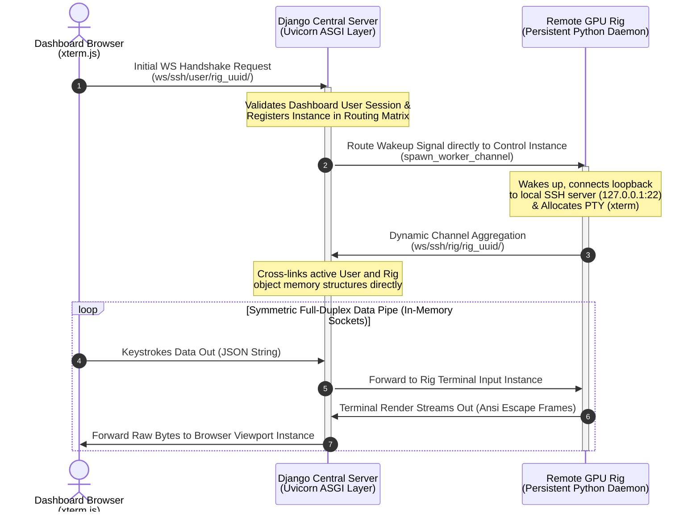

markdown# Implementation Specification: Reverse SSH Terminal Emulation Over HTTPS (Redis-Free)

This document provides a highly detailed, line-by-line implementation blueprint to embed an interactive, zero-port-configuration web SSH terminal directly into the `GPU-Rig-Monitoring-Platform`.

## 1. Network Topology & Point-to-Point Architecture

Because target rigs run telemetry scripts inside stateless, 60-second cron tasks (`agent/run.py`), they cannot serve as a reliable anchor for terminal sockets. This plan implements a lightweight, persistent systemd worker (`agent/terminal_daemon.py`) that sits idle on the rig and communicates with an ASGI server layered on top of the existing Django WSGI stack. 

Connections are bridged directly in the Django application memory space using an active routing dictionary matrix, bypassing the need for an external Redis channel broker.

```text
┌─────────────────────────┐           ┌────────────────────────┐           ┌────────────────────────┐
│   Dashboard UI Layout   │           │ Central Django Server  │           │   Target Remote Rig    │
│  (xterm.js + WebSockets)│           │ (Uvicorn Async Worker) │           │ (Persistent Py Daemon) │
└────────────┬────────────┘           └───────────┬────────────┘           └───────────┬────────────┘
             │                                    │                                    │
             │  1. Initial WS Handshake Request   │                                    │
             ├───────────────────────────────────►│                                    │
             │                                    │                                    │
             │                                    │  2. Route Signal Event Over WS     │
             │                                    ├───────────────────────────────────►│
             │                                    │                                    │ (Launches Local
             │                                    │                                    │  Loopback Tunnel)
             │                                    │  3. Dynamic Channel Aggregation    │
             │                                    │◄───────────────────────────────────┤
             │                                    │                                    │
             │        4. Symmetric Full-Duplex Data Pipelines Interleaved              │
             │◄───────────────────────────────────┼───────────────────────────────────►│
             │         (Keystrokes Data Out ◄───► Terminal Render Frames In)           │
```



---

## 2. Server Infrastructure Configuration

### 2.1 Layering ASGI into Settings (`gpu_monitor/gpu_monitor/settings.py`)
Modify your server configuration file to register the `channels` routing runtime. The traditional `CHANNEL_LAYERS` block is entirely omitted to avoid Redis requirements.

```python
# Insert at the end of your existing INSTALLED_APPS array
INSTALLED_APPS = [
    # ... Your existing apps (accounts, rigs, metrics_app, dashboard, audit)
    'channels',
]

# Swap out the traditional WSGI declaration for the new ASGI interface entrypoint
ASGI_APPLICATION = 'gpu_monitor.asgi.application'
```

### 2.2 Constructing the ASGI Application Routing Table (`gpu_monitor/gpu_monitor/asgi.py`)
Create or replace your `asgi.py` file to handle traditional HTTP requests via WSGI while routing real-time terminal sockets through the channel authentication layer.

```python
import os
from django.core.asgi import get_asgi_application
from channels.routing import ProtocolTypeRouter, URLRouter
from channels.auth import AuthMiddlewareStack
from django.urls import path

os.environ.setdefault('DJANGO_SETTINGS_MODULE', 'gpu_monitor.settings')

# Initialize early HTTP application handling to ensure middle-tier apps load cleanly
django_asgi_app = get_asgi_application()

# Import consumers after Django initializes to prevent AppRegistryNotReady crashes
from dashboard.consumers import SSHTerminalConsumer

application = ProtocolTypeRouter({
    "http": django_asgi_app,
    "websocket": AuthMiddlewareStack(
        URLRouter([
            # Structural signature: ws/ssh/<client_type: user|rig|rig_control>/<rig_uuid>/
            path("ws/ssh/<str:client_type>/<uuid:rig_uuid>/", SSHTerminalConsumer.as_asgi()),
        ])
    ),
})
```

---

## 3. Backend Core Logic Implementation

### 3.1 Asynchronous WebSocket Consumer (`gpu_monitor/dashboard/consumers.py`)
Create this file to intercept connections, validate session tokens, and directly route proxy streams between consumers and client nodes via local system runtime memory.

```python
import json
from channels.generic.websocket import AsyncWebsocketConsumer

class SSHTerminalConsumer(AsyncWebsocketConsumer):
    # Core global router mapping active socket instances by rig_uuid
    # Structure: { "rig_uuid_string": { "user": UserSocketInstance, "rig": RigSocketInstance, "control": ControlSocketInstance } }
    active_routing_matrix = {}

    async def connect(self):
        self.client_type = self.scope['url_route']['kwargs']['client_type']
        self.rig_uuid = str(self.scope['url_route']['kwargs']['rig_uuid'])

        # Initialize the nested node dictionaries safely if not present
        if self.rig_uuid not in SSHTerminalConsumer.active_routing_matrix:
            SSHTerminalConsumer.active_routing_matrix[self.rig_uuid] = {"user": None, "rig": None, "control": None}

        await self.accept()

        # Explicit direct instance caching
        if self.client_type == 'user':
            if not self.scope["user"].is_authenticated:
                await self.close(code=4401)
                return
            SSHTerminalConsumer.active_routing_matrix[self.rig_uuid]["user"] = self
            
            # Wake up the control daemon on the rig directly if it's connected
            control_socket = SSHTerminalConsumer.active_routing_matrix[self.rig_uuid]["control"]
            if control_socket:
                await control_socket.send(text_data=json.dumps({"event": "spawn_worker_channel"}))

        elif self.client_type == 'rig':
            SSHTerminalConsumer.active_routing_matrix[self.rig_uuid]["rig"] = self

        elif self.client_type == 'rig_control':
            SSHTerminalConsumer.active_routing_matrix[self.rig_uuid]["control"] = self

    async def disconnect(self, close_code):
        # Gracefully clear references on disconnect to prevent leaks
        if self.rig_uuid in SSHTerminalConsumer.active_routing_matrix:
            if self.client_type in SSHTerminalConsumer.active_routing_matrix[self.rig_uuid]:
                SSHTerminalConsumer.active_routing_matrix[self.rig_uuid][self.client_type] = None

    async def receive(self, text_data=None, bytes_data=None):
        if not text_data:
            return
        
        payload = json.loads(text_data)
        session_cluster = SSHTerminalConsumer.active_routing_matrix.get(self.rig_uuid, {})

        if self.client_type == 'user':
            rig_socket = session_cluster.get("rig")
            if rig_socket:
                if payload.get("event") == "resize":
                    # Directly pipe size frames to the rig socket object
                    await rig_socket.send(text_data=json.dumps({
                        "event": "resize", 
                        "cols": payload.get("cols"), 
                        "rows": payload.get("rows")
                    }))
                else:
                    # Directly pipe input characters to the rig socket object
                    await rig_socket.send(text_data=json.dumps({
                        "event": "stdin", 
                        "data": payload.get("data")
                    }))
                
        elif self.client_type == 'rig':
            user_socket = session_cluster.get("user")
            if user_socket:
                # Directly pipe outbound text back to the browser window
                await user_socket.send(text_data=json.dumps({"data": payload.get("data")}))
```

---

## 4. Client Agent System Integration

Leave `agent/run.py` untouched to preserve telemetry tracking through cron. Instead, deploy this new agent module alongside it.

### 4.1 Script Deployment Blueprint (`agent/terminal_daemon.py`)
```python
import asyncio
import websockets
import paramiko
import json
import yaml
import sys
import os

CONFIG_PATH = "/etc/monitoring-agent/config.yaml"
if not os.path.exists(CONFIG_PATH):
    CONFIG_PATH = os.path.join(os.path.dirname(__file__), "config.yaml")

with open(CONFIG_PATH, "r") as f:
    config = yaml.safe_load(f)

API_KEY = config.get("api_key")
RIG_UUID = config.get("rig_uuid")
SERVER_HOST = "your-platform-domain.com" # Update to your production environment domain

async def handle_active_ssh_session():
    """Establishes an active data channel between the local SSH daemon and the server."""
    data_uri = f"wss://{SERVER_HOST}/ws/ssh/rig/{RIG_UUID}/"
    headers = {"X-API-Key": API_KEY}
    
    try:
        async with websockets.connect(data_uri, extra_headers=headers) as ws:
            # Connect loopback to the machine's local open SSH server
            ssh = paramiko.SSHClient()
            ssh.set_missing_host_key_policy(paramiko.AutoAddPolicy())
            
            # Authenticate using standard local system user profiles
            ssh.connect('127.0.0.1', port=22, username='riguser', password='securepassword')
            
            # CRITICAL: Request a pseudo-terminal (PTY) to support full-screen editors
            channel = ssh.invoke_shell()
            channel.get_pty(term='xterm', width=80, height=24)

            async def pipe_ssh_to_ws():
                while not channel.exit_status_ready():
                    if channel.recv_ready():
                        raw_bytes = channel.recv(4096)
                        if not raw_bytes:
                            break
                        # Decode safe utf-8 character matrix arrays skipping partial slices
                        data_str = raw_bytes.decode('utf-8', errors='ignore')
                        await ws.send(json.dumps({'data': data_str}))
                    await asyncio.sleep(0.01)

            async def pipe_ws_to_ssh():
                async for raw_msg in ws:
                    payload = json.loads(raw_msg)
                    event_type = payload.get("event")
                    
                    if event_type == "stdin":
                        channel.send(payload.get("data"))
                    elif event_type == "resize":
                        channel.resize_pty(cols=payload.get("cols"), rows=payload.get("rows"))

            await asyncio.gather(pipe_ssh_to_ws(), pipe_ws_to_ssh())
    except Exception as e:
        sys.stderr.write(f"Active session error: {str(e)}\n")

async def orchestrate_daemon_lifecycle():
    """Maintains a low-overhead control socket connection to listen for dashboard wake-up events."""
    control_uri = f"wss://{SERVER_HOST}/ws/ssh/rig_control/{RIG_UUID}/"
    
    while True:
        try:
            async with websockets.connect(control_uri, extra_headers={"X-API-Key": API_KEY}) as ws:
                async for raw_msg in ws:
                    payload = json.loads(raw_msg)
                    if payload.get("event") == "spawn_worker_channel":
                        # Asynchronously initialize the data channel worker loop
                        asyncio.create_task(handle_active_ssh_session())
        except Exception:
            # Network fallback recovery delay
            await asyncio.sleep(10)

if __name__ == "__main__":
    try:
        asyncio.run(orchestrate_daemon_lifecycle())
    except KeyboardInterrupt:
        sys.exit(0)
```

### 4.2 Updating the Installer Pipeline (`agent/install.sh`)
Append the following systemd generation logic into the tail end of your production setup file (`agent/install.sh`) to initialize the process on boot:

```bash
echo "Installing Persistent Remote Terminal Shell System Worker Daemon..."

# Copy script over to isolated run partition
cp terminal_daemon.py /opt/monitoring-agent/terminal_daemon.py
chmod +x /opt/monitoring-agent/terminal_daemon.py

# Write clean systemd daemon infrastructure specification sheet
cat << 'EOF' > /etc/systemd/system/gpu-rig-terminal.service
[Unit]
Description=GPU Rig Monitoring Platform Secure Remote SSH Reverse Terminal Daemon
After=network.target network-online.target
Wants=network-online.target

[Service]
Type=simple
User=root
WorkingDirectory=/opt/monitoring-agent
ExecStart=/opt/monitoring-agent/venv/bin/python3 /opt/monitoring-agent/terminal_daemon.py
Restart=always
RestartSec=5s
Environment=PYTHONUNBUFFERED=1

[Install]
WantedBy=multi-user.target
EOF

# Reload internal init states and trigger runtime start
systemctl daemon-reload
systemctl enable gpu-rig-terminal.service
systemctl start gpu-rig-terminal.service
echo "Terminal service successfully deployed and running in background."
```

---

## 5. Frontend UI Integration

Integrate the terminal view inside your HTMX layout tabs (`gpu_monitor/dashboard/templates/dashboard/` templates).

```html



<div class="bg-gray-900 text-white p-6 rounded-xl shadow-2xl border border-gray-800">
    <h2 class="text-xl font-bold mb-4">Interactive System Console — Rig ID: {{ rig.name }}</h2>
    
    <div class="p-2 bg-black rounded-lg border-2 border-gray-950 shadow-inner">
        <div id="xterm-terminal-viewport" class="w-full h-[550px]"></div>
    </div>
</div>

<link rel="stylesheet" href="https://jsdelivr.net" />
<script src="https://jsdelivr.net"></script>
<script src="https://jsdelivr.net"></script>

<script>
    document.addEventListener("DOMContentLoaded", function () {
        // Initialize xterm terminal component instance
        const term = new Terminal({
            cursorBlink: true,
            macOptionIsMeta: true,
            scrollback: 5000,
            theme: {
                background: '#000000',
                foreground: '#ffffff',
                cursor: '#00ff00',
                selectionBackground: 'rgba(255, 255, 255, 0.3)'
            },
            fontFamily: 'Fira Code, JetBrains Mono, SFMono-Regular, Menlo, Monaco, Consolas, monospace',
            fontSize: 14
        });

        const container = document.getElementById('xterm-terminal-viewport');
        term.open(container);

        // Attach fit addon to scale rows and cols to fill container space
        const fitAddon = new FitAddon.FitAddon();
        term.loadAddon(fitAddon);
        fitAddon.fit();

        // Connect user browser terminal session back to Django Channels routing path
        const wsProtocol = window.location.protocol === "https:" ? "wss://" : "ws://";
        const socketUrl = `${wsProtocol}${window.location.host}/ws/ssh/user/{{ rig.uuid }}/`;
        const socket = new WebSocket(socketUrl);

        // Forward keystrokes to Django
        term.onData(rawKeystroke => {
            if (socket.readyState === WebSocket.OPEN) {
                socket.send(JSON.stringify({ "data": rawKeystroke }));
            }
        });

        // Forward viewport resize matrices to align PTY wrapping limits on the rig
        const transmitViewportSizeChange = () => {
            fitAddon.fit();
            if (socket.readyState === WebSocket.OPEN) {
                socket.send(JSON.stringify({
                    "event": "resize",
                    "cols": term.cols,
                    "rows": term.rows
                }));
            }
        };
        
        window.addEventListener('resize', transmitViewportSizeChange);

        // Handle incoming data streams
        socket.onmessage = function (event) {
            const rawPayload = JSON.parse(event.data);
            if (rawPayload.data) {
                term.write(rawPayload.data);
            }
        };

        socket.onopen = function() {
            // Force first geometric check sync once connection opens
            setTimeout(transmitViewportSizeChange, 400);
        };

        socket.onclose = function (event) {
            term.write('\r\n\n\x1b[1;31m[Secure Remote Connection Terminated: Session Closed]\x1b[0m\r\n');
            window.removeEventListener('resize', transmitViewportSizeChange);
        };

        socket.onerror = function (err) {
            term.write('\r\n\n\x1b[1;31m[WebSocket Interface Transport Communication Error]\x1b[0m\r\n');
        };
    });
</script>

```

---

## 6. Production Nginx Configuration Updates (`gpu_monitor/deploy/nginx.conf`)

To run this layout in production without conflicting with your existing Gunicorn setup, you must modify `gpu_monitor/deploy/nginx.conf` so that paths matching `/ws/` bypass your WSGI layer and target your ASGI server instead.

```nginx
# Update the main site routing block configuration context rules
server {
    listen 443 ssl http2;
    server_name your-platform-domain.com;

    # ... Maintain your existing SSL, security, and logging directives

    # Standard application polling view interfaces mapped to sync gunicorn sockets
    location / {
        proxy_pass http://unix:/run/gunicorn.sock;
        include proxy_params;
    }

    # Intercept WebSockets paths and route them to your ASGI server (e.g., Uvicorn running on port 8001)
    location /ws/ {
        proxy_pass http://127.0.0.1:8001;
        proxy_http_version 1.1;
        
        # Core transport connection upgrade header parameters
        proxy_set_header Upgrade \$http_upgrade;
        proxy_set_header Connection "Upgrade";
        
        # Request contextual tracking markers
        proxy_set_header Host \$host;
        proxy_set_header X-Real-IP \$remote_addr;
        proxy_set_header X-Forwarded-For \$proxy_add_x_forwarded_for;
        proxy_set_header X-Forwarded-Proto \$scheme;
        
        # Prevent Nginx from dropping active terminal sessions on idle
        proxy_read_timeout 86400s;
        proxy_send_timeout 86400s;
    }
}
```

---

## 7. Server-Side ASGI Process Orchestration

To run the WebSocket infrastructure alongside your existing sync Gunicorn process, you must deploy a dedicated systemd supervisor script on your central server. This service ensures Uvicorn binds to port 8001 and remains active.

### 7.1 Creating the Server Asynchronous Worker Service
Create a new configuration file at `/etc/systemd/system/gpu-monitor-asgi.service`:

```ini
[Unit]
Description=GPU Monitoring Platform Uvicorn ASGI Application Service Daemon
After=network.target

[Service]
Type=simple
User=www-data
Group=www-data
WorkingDirectory=/var/www/GPU-Rig-Monitoring-Platform/gpu_monitor
ExecStart=/var/www/GPU-Rig-Monitoring-Platform/venv/bin/uvicorn gpu_monitor.asgi:application --host 127.0.0.1 --port 8001 --workers 4 --log-level info
Restart=always
RestartSec=3s
Environment=PYTHONUNBUFFERED=1

[Install]
WantedBy=multi-user.target
```

### 7.2 Activating the Server Process Pipeline
Run these commands to start the background worker:

```bash
sudo systemctl daemon-reload
sudo systemctl enable gpu-monitor-asgi.service
sudo systemctl start gpu-monitor-asgi.service
```


