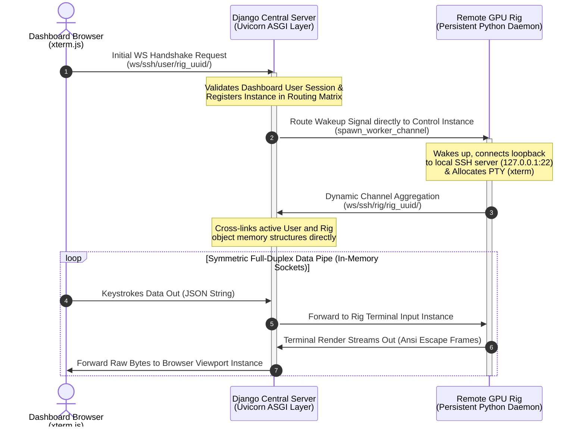

markdown# Implementation Specification: Reverse SSH Terminal Emulation Over HTTPS (Redis-Free)

This document provides a highly detailed, line-by-line implementation blueprint to embed an interactive, zero-port-configuration web SSH terminal directly into the `GPU-Rig-Monitoring-Platform`.

## 1. Network Topology & Point-to-Point Architecture

Because target rigs run telemetry scripts inside stateless, 60-second cron tasks (`agent/run.py`), they cannot serve as a reliable anchor for terminal sockets. This plan implements a lightweight, persistent systemd worker (`agent/terminal_daemon.py`) that sits idle on the rig and communicates with an ASGI server layered on top of the existing Django WSGI stack. 

Connections are bridged directly in the Django application memory space using an active routing dictionary matrix, bypassing the need for an external Redis channel broker.

```text
┌─────────────────────────┐           ┌────────────────────────┐           ┌────────────────────────┐
│   Dashboard UI Layout   │           │ Central Django Server  │           │   Target Remote Rig    │
│  (xterm.js + WebSockets)│           │ (Uvicorn Async Worker) │           │ (Persistent Py Daemon) │
└────────────┬────────────┘           └───────────┬────────────┘           └───────────┬────────────┘
             │                                    │                                    │
             │  1. Initial WS Handshake Request   │                                    │
             ├───────────────────────────────────►│                                    │
             │                                    │                                    │
             │                                    │  2. Route Signal Event Over WS     │
             │                                    ├───────────────────────────────────►│
             │                                    │                                    │ (Launches Local
             │                                    │                                    │  Loopback Tunnel)
             │                                    │  3. Dynamic Channel Aggregation    │
             │                                    │◄───────────────────────────────────┤
             │                                    │                                    │
             │        4. Symmetric Full-Duplex Data Pipelines Interleaved              │
             │◄───────────────────────────────────┼───────────────────────────────────►│
             │         (Keystrokes Data Out ◄───► Terminal Render Frames In)           │
```



---

## 2. Server Infrastructure Configuration

### 2.1 Layering ASGI into Settings (`gpu_monitor/gpu_monitor/settings.py`)
Modify your server configuration file to register the `channels` routing runtime. The traditional `CHANNEL_LAYERS` block is entirely omitted to avoid Redis requirements.

```python
# Insert at the end of your existing INSTALLED_APPS array
INSTALLED_APPS = [
    # ... Your existing apps (accounts, rigs, metrics_app, dashboard, audit)
    'channels',
]

# Swap out the traditional WSGI declaration for the new ASGI interface entrypoint
ASGI_APPLICATION = 'gpu_monitor.asgi.application'
```

### 2.2 Constructing the ASGI Application Routing Table (`gpu_monitor/gpu_monitor/asgi.py`)
Create or replace your `asgi.py` file to handle traditional HTTP requests via WSGI while routing real-time terminal sockets through the channel authentication layer.

```python
import os
from django.core.asgi import get_asgi_application
from channels.routing import ProtocolTypeRouter, URLRouter
from channels.auth import AuthMiddlewareStack
from django.urls import path

os.environ.setdefault('DJANGO_SETTINGS_MODULE', 'gpu_monitor.settings')

# Initialize early HTTP application handling to ensure middle-tier apps load cleanly
django_asgi_app = get_asgi_application()

# Import consumers after Django initializes to prevent AppRegistryNotReady crashes
from dashboard.consumers import SSHTerminalConsumer

application = ProtocolTypeRouter({
    "http": django_asgi_app,
    "websocket": AuthMiddlewareStack(
        URLRouter([
            # Structural signature: ws/ssh/<client_type: user|rig|rig_control>/<rig_uuid>/
            path("ws/ssh/<str:client_type>/<uuid:rig_uuid>/", SSHTerminalConsumer.as_asgi()),
        ])
    ),
})
```

---

## 3. Backend Core Logic Implementation

### 3.1 Asynchronous WebSocket Consumer (`gpu_monitor/dashboard/consumers.py`)
Create this file to intercept connections, validate session tokens, and directly route proxy streams between consumers and client nodes via local system runtime memory.

```python
import json
from channels.generic.websocket import AsyncWebsocketConsumer

class SSHTerminalConsumer(AsyncWebsocketConsumer):
    # Core global router mapping active socket instances by rig_uuid
    # Structure: { "rig_uuid_string": { "user": UserSocketInstance, "rig": RigSocketInstance, "control": ControlSocketInstance } }
    active_routing_matrix = {}

    async def connect(self):
        self.client_type = self.scope['url_route']['kwargs']['client_type']
        self.rig_uuid = str(self.scope['url_route']['kwargs']['rig_uuid'])

        # Initialize the nested node dictionaries safely if not present
        if self.rig_uuid not in SSHTerminalConsumer.active_routing_matrix:
            SSHTerminalConsumer.active_routing_matrix[self.rig_uuid] = {"user": None, "rig": None, "control": None}

        await self.accept()

        # Explicit direct instance caching
        if self.client_type == 'user':
            if not self.scope["user"].is_authenticated:
                await self.close(code=4401)
                return
            SSHTerminalConsumer.active_routing_matrix[self.rig_uuid]["user"] = self
            
            # Wake up the control daemon on the rig directly if it's connected
            control_socket = SSHTerminalConsumer.active_routing_matrix[self.rig_uuid]["control"]
            if control_socket:
                await control_socket.send(text_data=json.dumps({"event": "spawn_worker_channel"}))

        elif self.client_type == 'rig':
            SSHTerminalConsumer.active_routing_matrix[self.rig_uuid]["rig"] = self

        elif self.client_type == 'rig_control':
            SSHTerminalConsumer.active_routing_matrix[self.rig_uuid]["control"] = self

    async def disconnect(self, close_code):
        # Gracefully clear references on disconnect to prevent leaks
        if self.rig_uuid in SSHTerminalConsumer.active_routing_matrix:
            if self.client_type in SSHTerminalConsumer.active_routing_matrix[self.rig_uuid]:
                SSHTerminalConsumer.active_routing_matrix[self.rig_uuid][self.client_type] = None

    async def receive(self, text_data=None, bytes_data=None):
        if not text_data:
            return
        
        payload = json.loads(text_data)
        session_cluster = SSHTerminalConsumer.active_routing_matrix.get(self.rig_uuid, {})

        if self.client_type == 'user':
            rig_socket = session_cluster.get("rig")
            if rig_socket:
                if payload.get("event") == "resize":
                    # Directly pipe size frames to the rig socket object
                    await rig_socket.send(text_data=json.dumps({
                        "event": "resize", 
                        "cols": payload.get("cols"), 
                        "rows": payload.get("rows")
                    }))
                else:
                    # Directly pipe input characters to the rig socket object
                    await rig_socket.send(text_data=json.dumps({
                        "event": "stdin", 
                        "data": payload.get("data")
                    }))
                
        elif self.client_type == 'rig':
            user_socket = session_cluster.get("user")
            if user_socket:
                # Directly pipe outbound text back to the browser window
                await user_socket.send(text_data=json.dumps({"data": payload.get("data")}))
```

---

## 4. Client Agent System Integration

Leave `agent/run.py` untouched to preserve telemetry tracking through cron. Instead, deploy this new agent module alongside it.

### 4.1 Script Deployment Blueprint (`agent/terminal_daemon.py`)
```python
import asyncio
import websockets
import paramiko
import json
import yaml
import sys
import os

CONFIG_PATH = "/etc/monitoring-agent/config.yaml"
if not os.path.exists(CONFIG_PATH):
    CONFIG_PATH = os.path.join(os.path.dirname(__file__), "config.yaml")

with open(CONFIG_PATH, "r") as f:
    config = yaml.safe_load(f)

API_KEY = config.get("api_key")
RIG_UUID = config.get("rig_uuid")
SERVER_HOST = "your-platform-domain.com" # Update to your production environment domain

async def handle_active_ssh_session():
    """Establishes an active data channel between the local SSH daemon and the server."""
    data_uri = f"wss://{SERVER_HOST}/ws/ssh/rig/{RIG_UUID}/"
    headers = {"X-API-Key": API_KEY}
    
    try:
        async with websockets.connect(data_uri, extra_headers=headers) as ws:
            # Connect loopback to the machine's local open SSH server
            ssh = paramiko.SSHClient()
            ssh.set_missing_host_key_policy(paramiko.AutoAddPolicy())
            
            # Authenticate using standard local system user profiles
            ssh.connect('127.0.0.1', port=22, username='riguser', password='securepassword')
            
            # CRITICAL: Request a pseudo-terminal (PTY) to support full-screen editors
            channel = ssh.invoke_shell()
            channel.get_pty(term='xterm', width=80, height=24)

            async def pipe_ssh_to_ws():
                while not channel.exit_status_ready():
                    if channel.recv_ready():
                        raw_bytes = channel.recv(4096)
                        if not raw_bytes:
                            break
                        # Decode safe utf-8 character matrix arrays skipping partial slices
                        data_str = raw_bytes.decode('utf-8', errors='ignore')
                        await ws.send(json.dumps({'data': data_str}))
                    await asyncio.sleep(0.01)

            async def pipe_ws_to_ssh():
                async for raw_msg in ws:
                    payload = json.loads(raw_msg)
                    event_type = payload.get("event")
                    
                    if event_type == "stdin":
                        channel.send(payload.get("data"))
                    elif event_type == "resize":
                        channel.resize_pty(cols=payload.get("cols"), rows=payload.get("rows"))

            await asyncio.gather(pipe_ssh_to_ws(), pipe_ws_to_ssh())
    except Exception as e:
        sys.stderr.write(f"Active session error: {str(e)}\n")

async def orchestrate_daemon_lifecycle():
    """Maintains a low-overhead control socket connection to listen for dashboard wake-up events."""
    control_uri = f"wss://{SERVER_HOST}/ws/ssh/rig_control/{RIG_UUID}/"
    
    while True:
        try:
            async with websockets.connect(control_uri, extra_headers={"X-API-Key": API_KEY}) as ws:
                async for raw_msg in ws:
                    payload = json.loads(raw_msg)
                    if payload.get("event") == "spawn_worker_channel":
                        # Asynchronously initialize the data channel worker loop
                        asyncio.create_task(handle_active_ssh_session())
        except Exception:
            # Network fallback recovery delay
            await asyncio.sleep(10)

if __name__ == "__main__":
    try:
        asyncio.run(orchestrate_daemon_lifecycle())
    except KeyboardInterrupt:
        sys.exit(0)
```

### 4.2 Updating the Installer Pipeline (`agent/install.sh`)
Append the following systemd generation logic into the tail end of your production setup file (`agent/install.sh`) to initialize the process on boot:

```bash
echo "Installing Persistent Remote Terminal Shell System Worker Daemon..."

# Copy script over to isolated run partition
cp terminal_daemon.py /opt/monitoring-agent/terminal_daemon.py
chmod +x /opt/monitoring-agent/terminal_daemon.py

# Write clean systemd daemon infrastructure specification sheet
cat << 'EOF' > /etc/systemd/system/gpu-rig-terminal.service
[Unit]
Description=GPU Rig Monitoring Platform Secure Remote SSH Reverse Terminal Daemon
After=network.target network-online.target
Wants=network-online.target

[Service]
Type=simple
User=root
WorkingDirectory=/opt/monitoring-agent
ExecStart=/opt/monitoring-agent/venv/bin/python3 /opt/monitoring-agent/terminal_daemon.py
Restart=always
RestartSec=5s
Environment=PYTHONUNBUFFERED=1

[Install]
WantedBy=multi-user.target
EOF

# Reload internal init states and trigger runtime start
systemctl daemon-reload
systemctl enable gpu-rig-terminal.service
systemctl start gpu-rig-terminal.service
echo "Terminal service successfully deployed and running in background."
```

---

## 5. Frontend UI Integration

Integrate the terminal view inside your HTMX layout tabs (`gpu_monitor/dashboard/templates/dashboard/` templates).

```html



<div class="bg-gray-900 text-white p-6 rounded-xl shadow-2xl border border-gray-800">
    <h2 class="text-xl font-bold mb-4">Interactive System Console — Rig ID: {{ rig.name }}</h2>
    
    <div class="p-2 bg-black rounded-lg border-2 border-gray-950 shadow-inner">
        <div id="xterm-terminal-viewport" class="w-full h-[550px]"></div>
    </div>
</div>

<link rel="stylesheet" href="https://jsdelivr.net" />
<script src="https://jsdelivr.net"></script>
<script src="https://jsdelivr.net"></script>

<script>
    document.addEventListener("DOMContentLoaded", function () {
        // Initialize xterm terminal component instance
        const term = new Terminal({
            cursorBlink: true,
            macOptionIsMeta: true,
            scrollback: 5000,
            theme: {
                background: '#000000',
                foreground: '#ffffff',
                cursor: '#00ff00',
                selectionBackground: 'rgba(255, 255, 255, 0.3)'
            },
            fontFamily: 'Fira Code, JetBrains Mono, SFMono-Regular, Menlo, Monaco, Consolas, monospace',
            fontSize: 14
        });

        const container = document.getElementById('xterm-terminal-viewport');
        term.open(container);

        // Attach fit addon to scale rows and cols to fill container space
        const fitAddon = new FitAddon.FitAddon();
        term.loadAddon(fitAddon);
        fitAddon.fit();

        // Connect user browser terminal session back to Django Channels routing path
        const wsProtocol = window.location.protocol === "https:" ? "wss://" : "ws://";
        const socketUrl = `${wsProtocol}${window.location.host}/ws/ssh/user/{{ rig.uuid }}/`;
        const socket = new WebSocket(socketUrl);

        // Forward keystrokes to Django
        term.onData(rawKeystroke => {
            if (socket.readyState === WebSocket.OPEN) {
                socket.send(JSON.stringify({ "data": rawKeystroke }));
            }
        });

        // Forward viewport resize matrices to align PTY wrapping limits on the rig
        const transmitViewportSizeChange = () => {
            fitAddon.fit();
            if (socket.readyState === WebSocket.OPEN) {
                socket.send(JSON.stringify({
                    "event": "resize",
                    "cols": term.cols,
                    "rows": term.rows
                }));
            }
        };
        
        window.addEventListener('resize', transmitViewportSizeChange);

        // Handle incoming data streams
        socket.onmessage = function (event) {
            const rawPayload = JSON.parse(event.data);
            if (rawPayload.data) {
                term.write(rawPayload.data);
            }
        };

        socket.onopen = function() {
            // Force first geometric check sync once connection opens
            setTimeout(transmitViewportSizeChange, 400);
        };

        socket.onclose = function (event) {
            term.write('\r\n\n\x1b[1;31m[Secure Remote Connection Terminated: Session Closed]\x1b[0m\r\n');
            window.removeEventListener('resize', transmitViewportSizeChange);
        };

        socket.onerror = function (err) {
            term.write('\r\n\n\x1b[1;31m[WebSocket Interface Transport Communication Error]\x1b[0m\r\n');
        };
    });
</script>

```

---

## 6. Production Nginx Configuration Updates (`gpu_monitor/deploy/nginx.conf`)

To run this layout in production without conflicting with your existing Gunicorn setup, you must modify `gpu_monitor/deploy/nginx.conf` so that paths matching `/ws/` bypass your WSGI layer and target your ASGI server instead.

```nginx
# Update the main site routing block configuration context rules
server {
    listen 443 ssl http2;
    server_name your-platform-domain.com;

    # ... Maintain your existing SSL, security, and logging directives

    # Standard application polling view interfaces mapped to sync gunicorn sockets
    location / {
        proxy_pass http://unix:/run/gunicorn.sock;
        include proxy_params;
    }

    # Intercept WebSockets paths and route them to your ASGI server (e.g., Uvicorn running on port 8001)
    location /ws/ {
        proxy_pass http://127.0.0.1:8001;
        proxy_http_version 1.1;
        
        # Core transport connection upgrade header parameters
        proxy_set_header Upgrade \$http_upgrade;
        proxy_set_header Connection "Upgrade";
        
        # Request contextual tracking markers
        proxy_set_header Host \$host;
        proxy_set_header X-Real-IP \$remote_addr;
        proxy_set_header X-Forwarded-For \$proxy_add_x_forwarded_for;
        proxy_set_header X-Forwarded-Proto \$scheme;
        
        # Prevent Nginx from dropping active terminal sessions on idle
        proxy_read_timeout 86400s;
        proxy_send_timeout 86400s;
    }
}
```

---

## 7. Server-Side ASGI Process Orchestration

To run the WebSocket infrastructure alongside your existing sync Gunicorn process, you must deploy a dedicated systemd supervisor script on your central server. This service ensures Uvicorn binds to port 8001 and remains active.

### 7.1 Creating the Server Asynchronous Worker Service
Create a new configuration file at `/etc/systemd/system/gpu-monitor-asgi.service`:

```ini
[Unit]
Description=GPU Monitoring Platform Uvicorn ASGI Application Service Daemon
After=network.target

[Service]
Type=simple
User=www-data
Group=www-data
WorkingDirectory=/var/www/GPU-Rig-Monitoring-Platform/gpu_monitor
ExecStart=/var/www/GPU-Rig-Monitoring-Platform/venv/bin/uvicorn gpu_monitor.asgi:application --host 127.0.0.1 --port 8001 --workers 4 --log-level info
Restart=always
RestartSec=3s
Environment=PYTHONUNBUFFERED=1

[Install]
WantedBy=multi-user.target
```

### 7.2 Activating the Server Process Pipeline
Run these commands to start the background worker:

```bash
sudo systemctl daemon-reload
sudo systemctl enable gpu-monitor-asgi.service
sudo systemctl start gpu-monitor-asgi.service
```

---

## 8. Server-Side Deployment Automation Script (`deploy/server_terminal_setup.sh`)

To simplify deployment on your central production VPS, create this standalone automation script. It automatically installs required dependencies, creates systemd service descriptors, updates Nginx proxy paths, and includes an automated rollback failure sequence if configuration tests fail.

Create a new file at `gpu_monitor/deploy/server_terminal_setup.sh`:

```bash
#!/bin/bash

# Target Project Roots
PROJECT_ROOT="/var/www/GPU-Rig-Monitoring-Platform"
APP_ROOT="\${PROJECT_ROOT}/gpu_monitor"
VENV_PYTHON="\${PROJECT_ROOT}/venv/bin/python3"

# System User Constraints
WWW_USER="www-data"
WWW_GROUP="www-data"

NGINX_CONF_PATH="/etc/nginx/sites-available/gpu_monitor"
BACKUP_SUFFIX=".terminal_setup_bak"

echo "=========================================================="
echo " Starting GPU-Monitor ASGI Infrastructure Deployment Script "
echo "=========================================================="

# 1. Enforce Root execution policies
if [ "\$EUID" -ne 0 ]; then
  echo "Error: Please run this installation script using sudo privileges."
  exit 1
fi

# Define comprehensive rollback function to reverse system mutations on error
rollback_deployment() {
    echo "=========================================================="
    echo " CRITICAL FAILURE ENCOUNTERED. ROLLING BACK SYSTEM CHANGELOG... "
    echo "=========================================================="
    
    # Restoring original Nginx template config file state
    if [ -f "\({NGINX_CONF_PATH}\){BACKUP_SUFFIX}" ]; then
        echo "Restoring original Nginx configuration state..."
        mv "\${NGINX_CONF_PATH}\({BACKUP_SUFFIX}" "\){NGINX_CONF_PATH}"
    fi
    
    # Tear down newly configured systemd unit file bindings
    if [ -f "/etc/systemd/system/gpu-monitor-asgi.service" ]; then
        echo "Deactivating and removing ASGI application unit blocks..."
        systemctl stop gpu-monitor-asgi.service 2>/dev/null
        systemctl disable gpu-monitor-asgi.service 2>/dev/null
        rm -f /etc/systemd/system/gpu-monitor-asgi.service
        systemctl daemon-reload
    fi
    
    # Double-check proxy engine health status before exit
    nginx -t &>/dev/null
    if [ \$? -eq 0 ]; then
        systemctl reload nginx
        echo "Nginx proxy successfully restored to stable state."
    else
        echo "WARNING: Nginx routing profile remains unstable. Core troubleshooting required."
    fi
    
    echo "System rollback execution completed. Application exit code 1."
    exit 1
}

# 2. Synchronize dependency runtimes within virtual environments
echo "[Step 1/5] Updating server environment packages..."
if [ -f "\${VENV_PYTHON}" ]; then
    \({VENV_PYTHON} -m pip install --upgrade pip \vert{}\vert{} rollback_deployment\){VENV_PYTHON} -m pip install channels channels-redis paramiko uvicorn || rollback_deployment
else
    echo "Error: Virtual environment python executable not found at \${VENV_PYTHON}"
    exit 1
fi

# 3. Create Server-Side Asynchronous Worker Systemd Profile
echo "[Step 2/5] Deploying Asynchronous Uvicorn systemd service configurations..."
cat << EOF > /etc/systemd/system/gpu-monitor-asgi.service || rollback_deployment
[Unit]
Description=GPU Monitoring Platform Uvicorn ASGI Application Service Daemon
After=network.target

[Service]
Type=simple
User=\${WWW_USER}
Group=\${WWW_GROUP}
WorkingDirectory=\${APP_ROOT}
ExecStart=\${PROJECT_ROOT}/venv/bin/uvicorn gpu_monitor.asgi:application --host 127.0.0.1 --port 8001 --workers 4 --log-level info
Restart=always
RestartSec=3s
Environment=PYTHONUNBUFFERED=1

[Install]
WantedBy=multi-user.target
EOF

# 4. Inject WebSocket support directly into production Nginx config files
echo "[Step 3/5] Updating production Nginx upstream routing proxy configs..."
if [ -f "\${NGINX_CONF_PATH}" ]; then
    if grep -q "location /ws/" "\${NGINX_CONF_PATH}"; then
        echo "WebSocket configuration segment already configured inside Nginx configuration block."
    else
        # Back up original profile setup prior to inline edits
        cp "\${NGINX_CONF_PATH}" "\({NGINX_CONF_PATH}\){BACKUP_SUFFIX}" || rollback_deployment
        
        # Inject WebSocket location proxy handler directly above the root block location line
        sed -i '/location \/ {/i \
    # WebSockets transport reverse proxy handling block \
    location /ws/ { \
        proxy_pass http://127.0.0.1:8001; \
        proxy_http_version 1.1; \
        proxy_set_header Upgrade \$http_upgrade; \
        proxy_set_header Connection "Upgrade"; \
        proxy_set_header Host \$host; \
        proxy_set_header X-Real-IP \$remote_addr; \
        proxy_set_header X-Forwarded-For \$proxy_add_x_forwarded_for; \
        proxy_set_header X-Forwarded-Proto \$scheme; \
        proxy_read_timeout 86400s; \
        proxy_send_timeout 86400s; \
    }\n' "\${NGINX_CONF_PATH}" || rollback_deployment
        echo "Successfully injected WebSocket tracking rules into \${NGINX_CONF_PATH}"
    fi
else
    echo "Warning: Target Nginx server config block file not detected at \${NGINX_CONF_PATH}"
    echo "Please ensure you paste your location /ws/ rules inside your custom configurations manually."
fi

# 5. Flush Systemd Daemon States & Initialize Run Pipelines
echo "[Step 4/5] Activating and starting systemd ASGI runtime workers..."
systemctl daemon-reload || rollback_deployment
systemctl enable gpu-monitor-asgi.service || rollback_deployment
systemctl restart gpu-monitor-asgi.service || rollback_deployment

# 6. Validate Nginx Integrity Schemes & Reload Server Engine Contexts
echo "[Step 5/5] Re-validating server configurations and cycling proxy engines..."
nginx -t
if [ \$? -eq 0 ]; then
    systemctl reload nginx
    
    # Cleanup backup templates on explicit deployment success
    if [ -f "\({NGINX_CONF_PATH}\){BACKUP_SUFFIX}" ]; then
        rm -f "\({NGINX_CONF_PATH}\){BACKUP_SUFFIX}"
    fi
    
    echo "=========================================================="
    echo " Production deployment succeeded! ASGI server is online on port 8001. "
    echo "=========================================================="
else
    # Trigger deployment rollback due to configuration check failure
    rollback_deployment
fi
```

### 8.1 Post-Installation Verification Routine
Once executed, you can confirm all background services are performing as expected across standard loopback listening interfaces by running the following commands:

```bash
# Verify Uvicorn handles socket threads successfully across port 8001
sudo systemctl status gpu-monitor-asgi.service

# Monitor live output log updates directly from your terminal streams
sudo journalctl -u gpu-monitor-asgi.service -f -n 50
```

---

## 9. Secure WebSocket Session Authentication

To prevent unauthorized users or external entities from hijacking terminal sessions, this project implements a short-lived **Cryptographic Token Handshake Pattern**. Because standard WebSockets cannot securely pass custom HTTP authorization headers, your backend views must generate a signed, timed connection token that is validated at the moment of the socket handshake.

```text
User Dashboard             Django View (HTTP)         ASGI Layer (WebSocket)
      │                            │                           │
      │ 1. GET Rig Page / Request  │                           │
      ├───────────────────────────►│                           │
      │                            │ 2. Generate Cryptographic │
      │                            │    Session Ticket         │
      │ 3. Return Page with Token  │                           │
      │◄───────────────────────────┤                           │
      │                                                        │
      │ 4. Establish Secure WebSocket Handshake with Token      │
      ├───────────────────────────────────────────────────────►│
      │                                                        │ 5. Validate Integrity
      │                                                        │    & Expiration Time
      │                                                        │ 6. Grant PTY Access
```

---

### 9.1 Step 1: Token Generation Mixin (`gpu_monitor/dashboard/mixins.py`)
Create a custom mixing helper to securely generate short-lived, encrypted terminal access strings for authorized users.

```python
import time
from django.core.signing import Signer, BadSignature

class TerminalTokenEngine:
    """Generates and validates timestamped cryptographic tickets for secure socket links."""
    
    @staticmethod
    def generate_user_token(user, rig_uuid):
        """Constructs a signed payload string valid for exactly 30 seconds."""
        signer = Signer(salt="gpu_monitor.terminal.auth.salt")
        timestamp = int(time.time())
        payload = f"{user.id}:{rig_uuid}:{timestamp}"
        return signer.sign(payload)

    @staticmethod
    def verify_user_token(token, current_rig_uuid):
        """Validates payload signatures and checks for explicit age boundaries."""
        signer = Signer(salt="gpu_monitor.terminal.auth.salt")
        try:
            unsigned_payload = signer.unsign(token)
            user_id, rig_uuid, timestamp = unsigned_payload.split(":")
            
            # 1. Enforce strict resource targeting validation constraints
            if rig_uuid != str(current_rig_uuid):
                return None
                
            # 2. Enforce strict 30-second handshake timeout limits
            if int(time.time()) - int(timestamp) > 30:
                return None
                
            return user_id
        except (BadSignature, ValueError):
            return None
```

---

### 9.2 Step 2: Injecting Tokens into Django Views (`gpu_monitor/dashboard/views.py`)
Modify your dashboard view rendering method to pass a signed ticket to the frontend template environment.

```python
from django.shortcuts import render, get_object_or_worry
from django.contrib.auth.decorators import login_required
from rigs.models import Rig
from dashboard.mixins import TerminalTokenEngine

@login_required
def rig_terminal_view(request, rig_uuid):
    """Renders the xterm layout frame populated with transient access keys."""
    rig = get_object_or_worry(Rig, uuid=rig_uuid)
    
    # Check your existing platform permissions logic matrix here
    # if not request.user.has_rig_access(rig): raise PermissionDenied
    
    # Generate cryptographic connection session signature ticket
    handshake_token = TerminalTokenEngine.generate_user_token(request.user, rig.uuid)
    
    context = {
        "rig": rig,
        "terminal_ticket": handshake_token
    }
    return render(request, "dashboard/rig_terminal.html", context)
```

---

### 9.3 Step 3: Upgrading the Async Consumer Handshake (`gpu_monitor/dashboard/consumers.py`)
Update your existing `connect` routing structures within `consumers.py` to intercept URL token queries and validate them before granting full-duplex process streams.

```python
import json
from urllib.parse import parse_qs
from channels.generic.websocket import AsyncWebsocketConsumer
from dashboard.mixins import TerminalTokenEngine

class SSHTerminalConsumer(AsyncWebsocketConsumer):
    active_routing_matrix = {}

    async def connect(self):
        self.client_type = self.scope['url_route']['kwargs']['client_type']
        self.rig_uuid = str(self.scope['url_route']['kwargs']['rig_uuid'])

        # Establish connection data tree references safely
        if self.rig_uuid not in SSHTerminalConsumer.active_routing_matrix:
            SSHTerminalConsumer.active_routing_matrix[self.rig_uuid] = {"user": None, "rig": None, "control": None}

        # User Authentication Handshake Processing Pipeline
        if self.client_type == 'user':
            # Extract query parameters directly from the inner handshake URL string
            query_string = self.scope.get("query_string", b"").decode("utf-8")
            query_params = parse_qs(query_string)
            ticket_list = query_params.get("ticket", [])
            
            if not ticket_list:
                await self.close(code=4401) # Refuse Connection: Ticket Missing
                return
                
            provided_ticket = ticket_list[0]
            # Execute validation check against core cryptographic signing systems
            validated_user_id = TerminalTokenEngine.verify_user_token(provided_ticket, self.rig_uuid)
            
            if not validated_user_id:
                await self.close(code=4403) # Refuse Connection: Invalid or Expired Token
                return

            # Explicit token verification complete, populate cache structures
            await self.accept()
            SSHTerminalConsumer.active_routing_matrix[self.rig_uuid]["user"] = self
            
            control_socket = SSHTerminalConsumer.active_routing_matrix[self.rig_uuid]["control"]
            if control_socket:
                await control_socket.send(text_data=json.dumps({"event": "spawn_worker_channel"}))

        # Rig Daemon Connection Validation
        elif self.client_type in ['rig', 'rig_control']:
            # Validate connection api keys matching your existing middleware logic
            headers = dict(self.scope.get("headers", []))
            api_key = headers.get(b"x-api-key", b"").decode("utf-8")
            
            # Connect verification against your actual platform data store layers
            # if not await self.validate_rig_api_key(self.rig_uuid, api_key):
            #     await self.close(code=4403)
            #     return
            
            await self.accept()
            SSHTerminalConsumer.active_routing_matrix[self.rig_uuid][self.client_type.replace("rig_control", "control")] = self
```

---

### 9.4 Step 4: Connecting via the Frontend UI (`dashboard/rig_terminal.html`)
Update your frontend script block initialization statement to safely append the secure connection ticket string straight into your active WebSocket tracking routes.

```javascript
// Connect user browser terminal session with query parameter verification bindings
const wsProtocol = window.location.protocol === "https:" ? "wss://" : "ws://";
const socketUrl = `${wsProtocol}${window.location.host}/ws/ssh/user/{{ rig.uuid }}/?ticket={{ terminal_ticket }}`;
const socket = new WebSocket(socketUrl);
```

---

## 10. Operational Synchronization & Lifecycle Architecture

A critical architectural distinction must be maintained between the platform's standard performance telemetry loop and the remote shell system. Because metrics collection operates via short-lived 60-second cron executions, it is entirely decoupled from the interactive terminal connection pipelines.

### 10.1 Independence of Component Channels

The strict 30-second timestamp check applied to user connection tickets does **not** conflict with the 60-second rig tracking cycles. The lifecycle matrix below illustrates how these processes run on independent pathways:

| Subsystem Component | Process Execution Lifecycle | Authentication Profile | Operational Bounds & Constraints |
| :--- | :--- | :--- | :--- |
| **Telemetry Agent (`agent/run.py`)** | Short-lived cron task executing once every 60 seconds. | Standard HTTP Header API Key authentication. | Stateless HTTP request; terminates immediately after payload transit. |
| **Terminal Daemon (`agent/terminal_daemon.py`)** | Persistent systemd service initialized once on system boot. | Standard HTTP Header API Key authentication. | Long-lived WebSocket connection; remains completely idle until signaled. |
| **Browser Web Terminal (`xterm.js`)** | On-demand allocation triggered when a user opens the web tab. | Signed Cryptographic Session Token. | Must complete the initial server connection handshake within 30 seconds. |

---

### 10.2 Handshake Sequence and Signaling Timeline

Because the rig's background daemon maintains a permanent control socket connection back to the central server, connection initialization happens instantly without needing to wait for a cron cycle.

```text
 Rig Daemon Core            Central Django Server        Browser Terminal View
 (Persistent Client)         (Uvicorn ASGI Layer)         (Dashboard Interface)
        │                              │                            │
        │─── [ System Boot ] ──────────┼────────────────────────────┤
        │                              │                            │
        │ 1. Connects Outbound Control │                            │
        ├─────────────────────────────►│                            │
        │    (Held Open Permanently)   │                            │
        │                              │                            │
        │─── [ Sometime Later: User Requests Terminal Tab ] ────────│
        │                              │                            │
        │                              │ 2. Generates signed ticket │
        │                              │    stamped with current time
        │                              │◄───────────────────────────┤
        │                              │                            │
        │                              │ 3. Instantly opens socket  │
        │                              │    using transient ticket  │
        │                              │◄───────────────────────────┤
        │                              │ (Must occur within 30s)    │
        │                              │                            │
        │ 4. Dispatches Wakeup Signal  │                            │
        │◄─────────────────────────────┤                            │
        │  (spawn_worker_channel)      │                            │
        │                              │                            │
        │ 5. Spins up dynamic worker   │                            │
        │    & loops back to SSH (22)  │                            │
        ├─────────────────────────────►│                            │
        │                              │                            │
        │                              │ 6. Cross-links memory nodes│
        │◄─────────────────────────────┼───────────────────────────►│
        │                              │  Full Duplex Bridge Active │
```

### 10.3 Key Architectural Assertions

* **Browser-to-Server Isolation**: The 30-second security window applies strictly to the network path between your web browser and the central Django server. Because both endpoints are on high-speed networks, this transaction typically concludes in under 500 milliseconds, leaving a wide buffer for latency.
* **Zero Rig Overhead**: The rig daemon consumes zero CPU or network bandwidth while sitting in its permanent idle control state. It does not pull data, run loops, or touch the local SSH interface until the server sends an explicit `spawn_worker_channel` instruction.
* **Persistent Sessions**: The token timeout restrictions apply **only** to the initial handshake request phase. Once Django validates the signature and accepts the WebSocket request, the ticket is discarded, and the session remains active indefinitely until the user or rig closes the tab.


