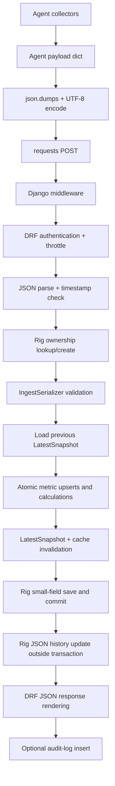

# Ingest and Serialization Operation/Cost Analysis

## Investigation status

- Repository: `GPU-Rig-Monitoring-Platform`
- Base commit: `ad965ab` (`origin/main`, merge PR #198)
- Analysis branch: `plan/ingest-serialization-costs-v2`
- Method: static code inspection and exact ORM call counting only
- Not performed: profiling, benchmarks, database queries, full tests, or creation/installation of a test environment
- Runtime limitation: system Python cannot import Django, and the repository contains no tracked dependency/venv definition. A runtime import attempt failed with `ModuleNotFoundError: django`; no packages were installed.

## Scope

This report covers:

1. Agent-side payload construction and JSON serialization.
2. HTTP transport to `POST /api/v1/ingest/`.
3. Django/DRF middleware, authentication, throttling, parsing, and validation.
4. Every server-side read, calculation, write, cache operation, transaction boundary, and response-rendering operation in the ingest path.
5. Big-O complexity plus planning-range latency estimates.

The estimates are not measurements. Database and HTTP timings depend on hardware, row width, indexes, network distance, cache backend, active API-key count, and payload size.

## Data flow



## Agent-side serialization

Evidence: `agent/run.py:1226-1342`.

| Step | Operation | Cost |
|---|---|---|
| Build payload dict | Calls collectors and assembles nested CPU, memory, storage, network, GPU, process, container, software, error, and power structures. | `O(B)` CPU and memory, where `B` is payload size. Collector I/O is outside server-ingest cost. |
| Compute job state | Evaluates GPU-process list and scans containers for `status == 'running'`. | `O(P + C)` time, `O(1)` extra memory. |
| Serialize JSON | `json.dumps(payload, default=str)` traverses every value and converts unsupported values through `str()`. | `O(B)` CPU, `O(B)` temporary string memory. |
| UTF-8 encode | Encodes the complete JSON string once before retries. | `O(B)` CPU and `O(B)` bytes. The same byte string is reused for all retry attempts. |
| Add headers | Builds content type, plaintext API key, rig UUID, and user-agent headers. | `O(1)` metadata work; key material remains in process memory. |
| Local payload log | `log_payload(payload)` runs a second `json.dumps(..., indent=2, default=str)` and writes the full payload to disk. | Another `O(B)` CPU pass, `O(B)` memory, and `O(B)` disk write on every heartbeat. This is duplicate serialization work. |
| HTTP POST | Sends the already-encoded body with a 3-second connect and 10-second read timeout. | Network latency dominates; server work is remote from the agent. |
| Response parse | Calls `resp.json()` when response content exists. | `O(R)` CPU/memory, where `R` is the small response body size. |
| Retry | On request failure, waits `2**attempt + random(0, 0.4)` seconds and retries up to the configured attempt count, default 3. | Up to 3 HTTP attempts plus roughly 1–5 seconds of backoff. JSON encoding is not repeated. |

The Windows agent performs the same serialization and transport sequence in `agent_windows/run.py:1470-1550` and `:1835-1839`.

## Agent collector operation detail

Evidence: `agent/run.py:128-1221` and `agent/run.py:1226-1358`.

| Collector | Operations before payload serialization | Estimated cost |
|---|---|---|
| Startup | Sleeps for random jitter from 0 to 25 seconds, loads YAML config, sets up logging, and arms a 30-second `SIGALRM` collection timeout by default. | Jitter is intentional wall-clock load spreading; logging and config are small. The alarm bounds collection/retry work. |
| CPU | `psutil.cpu_percent(interval=1)` waits one second; reads physical/logical CPU counts and load average; scans temperature sensors with three fallback passes; reads CPU frequency; optionally calls `cpuinfo`. | At least 1 second of elapsed time plus OS/sysfs calls. Temperature and CPU-info failures are caught and do not abort the heartbeat. |
| RAPL power | Scans `/sys/class/powercap`, reads energy counters, sleeps 0.1 seconds, rereads counters, handles wraparound, and divides by the sample window. | About 0.1 seconds plus filesystem I/O; returns `None` on missing/invalid RAPL data. |
| Power fallback | Computes CPU estimate from utilization/core count, initializes NVML, sums GPU power, adds flat 40 W, divides by 0.90 PSU efficiency, and rounds values. | `O(G)` NVML calls plus small arithmetic; NVML failure falls back to zero GPU power without aborting. |
| Memory | Calls `virtual_memory()` and `swap_memory()` and copies totals/usage/free/cached values. | Small `psutil`/OS cost, `O(1)` payload fields. |
| Motherboard | Reads board vendor, board name, and BIOS version from sysfs, stripping whitespace. | Three small filesystem reads; failures become `unknown`. |
| Storage | Gets per-disk I/O counters once, scans disk partitions, calls `disk_usage()` per partition, maps partitions to whole disks, and optionally runs `sudo smartctl -a` with a 5-second timeout. For NVMe, it may run `sudo nvme smart-log` with another 5-second timeout. | `O(D)` Python work plus external command I/O; worst-case SMART/NVMe command time can approach 10 seconds per partition. |
| Network | Reads per-interface byte/error counters and address lists, skips loopback/no-IPv4 interfaces, and reads `/sys/class/net/<iface>/speed` when available. | `O(N)` OS/sysfs work; no network request is made by the collector itself. |
| GPUs | Initializes NVML, enumerates devices, and calls NVML for memory, utilization, temperature, fan, power/limit, PCIe generation/width, and clocks per GPU; decodes bytes to UTF-8 and shuts NVML down. | `O(G)` NVML round trips plus small conversions; NVML exceptions are caught per device. |
| GPU processes | Runs `nvidia-smi` with a 10-second timeout and parses process-table lines into GPU index, PID, type, name, and memory. | One external process plus `O(output lines × line length)` parsing; failure returns an empty list. |
| Docker discovery | Tries `docker ps` directly and then `sudo docker ps`, each with a 10-second timeout; if successful, runs one `docker ps -a --no-trunc` with a 15-second timeout. | Up to three external commands; `O(C)` parsing of container rows. |
| Docker enrichment | For every running container, runs `docker inspect` with a 5-second timeout, parses JSON, builds a manifest, and either reads the last 100 log-file lines or runs `docker logs --tail 100` with a 10-second timeout. | Up to two external commands per running container plus JSON/log parsing; this can dominate agent CPU and wall time for many containers. |
| Top processes | Iterates all processes for baseline data, sleeps 0.5 seconds, rereads CPU percentages, truncates command lines, and sorts twice for top-20 CPU/memory lists. | `O(M)` process enumeration plus 0.5-second wait and two `O(M log M)` sorts; payload keeps only 20 entries per list. |
| Software | Reads hostname/platform/kernel, computes uptime from boot time, runs `nvidia-smi --query-gpu=driver_version`, and runs `docker version --format ...`, each external command capped at 5 seconds. | Small platform calls plus up to two external command round trips. |
| Errors | Runs `sudo journalctl -p err..crit --since 5 min ago` with a 10-second timeout, deduplicates up to the first 20 output lines, and truncates messages to 200 characters. | One external process plus `O(J)` line scanning and deduplication. |
| Payload assembly | Collects GPU processes and Docker first, computes `has_active_job`, then collects CPU, memory, storage, network, GPUs, and top processes; finally collects motherboard, software, errors, and power. | `O(B)` dict/list assembly after all external collection; collection order is intentional because job state uses process/container results. |

The Windows agent has the same payload/transport stages, with platform-specific WMI and Windows process/Docker collection paths. The server cost analysis below is independent of which collector produced the payload.

## Server request lifecycle

Evidence: `gpu_monitor/metrics_app/urls.py:7`, `gpu_monitor/metrics_app/views.py:26-117`, `gpu_monitor/gpu_monitor/settings.py:54-64`, `gpu_monitor/accounts/authentication.py:5-17`.

| Step | Operation | Cost |
|---|---|---|
| URL resolution | Matches `/api/v1/ingest/` to `IngestView.as_view()`. | `O(1)` routing work. |
| Django middleware | Runs security, session, common, CSRF, authentication, messages, clickjacking, HTMX, and audit middleware. `csrf_exempt` skips CSRF validation for this view. | Usually `O(1)`; session DB access is lazy and normally absent for an API-key request. |
| DRF initialization | Performs authentication, permission checks, and throttle checks before `post()`. No permission class is configured, so the API-key authenticator is the security gate. | `O(A)` for API-key validation; cache throttle operations are expected `O(1)`. |
| API-key lookup | Reads `X-API-Key`; if present, queries all active `ApiKey` rows with `select_related('user')`. There is no index on `key_hash`. | One SQL `SELECT` scanning `A` active keys. CPU is `O(A)` Argon2 verifications in the worst case. |
| API-key verification | Calls `PasswordHasher.verify()` for each active key until a match. A match updates `last_used_at` with one `UPDATE`. | Argon2 is intentionally expensive: planning range roughly 30–150 ms per candidate on typical server CPU. Invalid keys or many active keys can dominate the entire request. |
| Ingest throttle | Uses `X-Rig-UUID` as the key and `ingest=2/min` as the rate. With no `CACHES` setting, Django's default process-local `LocMemCache` is used. | One cache read and one cache write per request, expected `<0.1 ms`; it is not a distributed fleet-wide throttle. |
| JSON parsing | `request.data` invokes DRF's JSON parser and converts the request bytes to Python objects. | `O(B)` CPU and temporary memory. |
| Object/type checks | Confirms the parsed value is a dict and checks `rig_uuid`. | `O(1)` plus string conversion of the UUID. |
| Timestamp check | Parses the timestamp with `parse_datetime`, normalizes a naive value to UTC, obtains `now`, and computes an absolute time difference. | One parse plus `O(1)` arithmetic; a valid timestamp is parsed again later by `DateTimeField`. |
| Rig lookup | `Rig.objects.get(uuid=rig_uuid)` uses the UUID primary key. | One indexed PostgreSQL query, typically about 0.5–3 ms local. |
| New rig enrollment | If lookup misses, creates a `Rig` row and attaches an audit event to the request. | One `INSERT`; audit middleware performs a second `INSERT` after the response. |
| Ownership check | Compares `rig.owner_id` with the authenticated user ID. | `O(1)` Python comparison; mismatch returns HTTP 409 before payload processing. |
| Key rotation flag | Compares `rig.enrolled_by_api_key_id` with `api_key.id` and mutates the in-memory rig object if needed. | `O(1)`; the eventual `rig.save()` includes the field when changed. |
| Dispatch to serializer | Calls `process_ingest()` with the already-loaded rig and owner ID. | `O(1)` call setup. |

### Validation details

Evidence: `gpu_monitor/metrics_app/serializers.py:19-61`.

`IngestSerializer.is_valid()` performs these operations:

- `UUIDField`: parses and canonicalizes `rig_uuid`; invalid UUIDs produce a field error.
- `DateTimeField`: parses and normalizes the timestamp; this repeats timestamp parsing performed by the view.
- `CharField`: validates schema and agent version, applying defaults when absent.
- `JSONField`: accepts the already-parsed nested dictionaries/lists; it does not perform a full nested schema validation.
- `ListField`: validates that `errors` is a list; the untyped child field means there is no detailed per-error child schema.
- `BooleanField`: converts `has_active_job` to a Python bool.
- `validate_schema_version`: performs a fixed 14-value membership check.
- Error formatting: only runs when validation fails; cost is proportional to the number of errors.

The serializer then copies references to the nested structures and builds `real_errors` with a list comprehension. That pass is `O(E × M)` in the total error-message length because it calls `.strip()` and checks the message.

## Server-side ingest operations

Evidence: `gpu_monitor/metrics_app/serializers.py:38-716`.

| Step | Operation | Complexity and estimated cost |
|---|---|---|
| Previous snapshot read | `LatestSnapshot.objects.filter(rig_uuid=rig_uuid).first()` loads the current row and all JSON fields. | One indexed `SELECT`; `O(L)` JSON decode/memory, where `L` is the previous snapshot's JSON size. Typical local planning range 1–5 ms plus 0.1–2 ms per 100 KB of JSON. |
| Previous-array extraction | Converts each stored JSON array to a Python list and saves the previous timestamp. | `O(L)` memory copies; no additional SQL. |
| CPU/memory extraction | Reads scalar values and nested frequency fields from validated data. | `O(1)` dictionary lookups. |
| Real-error filtering | Filters placeholder errors and strips messages. | `O(E × M)` CPU, `O(E)` output memory. |
| List extraction | Gets CPU, memory, GPU, storage, network, process, and container lists from `metrics`. | `O(1)` references; no deep copy. |
| Transaction start | Enters `transaction.atomic()`. | One PostgreSQL `BEGIN`; negligible CPU, but it holds locks until commit/rollback. |
| MetricSnapshot upsert | `update_or_create()` on `(rig_uuid, schema_version, timestamp)`. | Normally 1 `SELECT` + 1 `INSERT`/`UPDATE`; 2 queries. Unique constraint and `(rig_uuid, timestamp)` index support lookup. Planning range 1–5 ms. |
| GPU loop | For each of `G` GPUs, strips a `GPU-` prefix for the DB value, performs an upsert, and appends 16 summary values. | `2G` SQL queries, `O(G)` Python work, `O(G)` summary memory. Each upsert is typically 1–5 ms; this is usually the dominant per-heartbeat query count. |
| GPU-process shaping | Builds a compact dict for each process and truncates names to 500 characters. | `O(P × Mproc)` CPU for process-name copying, `O(P)` memory; no time-series write. |
| Storage loop | For each of `D` disks, looks up the previous device by list membership and index, computes four deltas and utilization, appends summary arrays, and upserts a row. | `O(D × Dprev)` worst-case Python lookup time because both `in` and `index()` scan lists; `O(D)` memory; `2D` SQL queries. Arithmetic is `O(1)` per disk. |
| Storage counter reset handling | If a new counter is lower than the previous counter, uses the new counter as the delta. | `O(1)` per counter; no DB work. |
| Network loop | For each of `N` interfaces, performs list membership/index lookup, computes RX/TX deltas, upserts a row, and appends summary arrays. | `O(N × Nprev)` worst-case lookup time; `O(N)` memory; `2N` SQL queries. |
| Container validation | Deduplicates container IDs with a set, skips empty/duplicate IDs, and constructs model instances without saving them. | Expected `O(C)` time and memory; individual construction failures are logged and skipped. |
| Container replacement | If at least one valid container exists, deletes all rows for the rig, then bulk-inserts the new list with `ignore_conflicts=True`. | Exactly 2 SQL queries when nonempty: 1 `DELETE` + 1 bulk `INSERT`; `O(C)` Python and DB payload work. If empty, no container query is issued, so old rows remain. |
| LatestSnapshot defaults | Builds more than 60 scalar and JSON-array fields from the in-memory lists. | `O(Lnew)` CPU/memory, where `Lnew` is the new denormalized snapshot size. |
| Power processing | Converts power values to floats, rounds them, and performs a cache TTL check. The former `PowerReading` write is now a no-op. | `O(1)` arithmetic; one cache `add` per heartbeat, with no DB write. |
| LatestSnapshot upsert | `update_or_create()` by rig UUID with the large `defaults` dictionary. | Normally 1 `SELECT` + 1 `INSERT`/`UPDATE`; 2 queries. JSON serialization and network transfer are `O(Lnew)`; planning range 1–5 ms DB plus 0.1–2 ms per 100 KB. |
| Snapshot cache invalidation | Deletes `lsnap_{rig_uuid}`. | Expected `O(1)` cache operation. |
| Report cache invalidation | Deletes `report_{rig_uuid}_{24,168,720}`. | 3 expected `O(1)` cache operations. |
| Chart cache invalidation | Increments `chart_v_{rig_uuid}`; if missing, sets it to 1. | 1 cache operation on a hit; 2 on a miss. This avoids thousands of per-chart deletes. |
| Status transition tracking | If the previous rig status differs from `online`, inserts a `RigStatusEvent`. | 1 `INSERT` only on a transition; otherwise no query. |
| Latest error shaping | Truncates each message to 200 characters and keeps the first 10 errors. | `O(min(E,10) × M)` CPU/memory. |
| Error history update | Copies existing JSON history/hash lists, hashes each new error with SHA256, deduplicates, appends, and trims to 1000/200 entries. | `O(H + E × M + S)` expected time; `O(H + S + E)` memory. SHA256 is linear in message length. |
| Container history update | Copies history/hash lists, hashes container ID/status/status-text, deduplicates, appends, and trims. | `O(Hc + C × M + Sc)` expected time; `O(Hc + Sc + C)` memory. |
| Rig small-field save | Sets `last_seen`, `status`, and optionally `enrolled_by_api_key`, then saves only those fields. | One `UPDATE` query; short transaction lock. |
| Rig cache invalidation | Deletes `rig_light_{rig_uuid}` and `lsnap_{rig_uuid}`. | 2 expected `O(1)` cache operations; `lsnap` is deleted twice in the normal path. |
| Transaction commit | Commits all writes in the atomic block. | One PostgreSQL `COMMIT`; latency includes WAL flush and lock release. |
| Large Rig JSON update | After commit, `QuerySet.update()` writes five JSON/history fields in one SQL statement. | One `UPDATE`, no model load and no `post_save` signals; `O(H + Hc)` serialization and DB payload work. A crash between commit and this update can leave history stale until the next heartbeat. |
| Response construction | Creates a small dict containing `status`, `message`, and `next_expected`. | `O(1)` CPU/memory. |
| Exception path | Any exception inside the atomic block rolls back all writes, logs the exception, and returns HTTP 500. | Rollback plus log I/O; no partial metric commit from that request. |

## Exact query-count formulas

Let:

- `G` = number of GPUs
- `D` = number of storage devices
- `N` = number of network interfaces
- `C` = number of valid containers
- `A` = number of active API keys
- `T` = 1 when a rig status transition occurs, otherwise 0

For a normal existing rig with at least one valid container and a valid API key:

```text
API auth:          1 SELECT + 1 UPDATE
Rig lookup:        1 SELECT
Previous snapshot: 1 SELECT
MetricSnapshot:    2 queries
GPU upserts:       2G queries
Storage upserts:   2D queries
Network upserts:   2N queries
Containers:        2 queries
LatestSnapshot:    2 queries
Rig small save:    1 UPDATE
Rig JSON update:   1 UPDATE
Status event:      T INSERT

Total = 12 + 2G + 2D + 2N + T SQL statements
```

If there are no valid containers, subtract 2. A new rig replaces the existing-rig lookup with one `Rig` `INSERT` and one post-response audit `INSERT`, so its baseline increases by one statement; its status transition normally adds one more insert. An invalid API key normally performs one active-key `SELECT` and then stops before the view.

These are statement counts, not latency measurements. `update_or_create()` may perform an extra attempt under a uniqueness race, and PostgreSQL query plans depend on table statistics and index health.

## Cache operation count

For the normal existing-rig path:

```text
Throttle:       2 LocMemCache operations
Power TTL:      1 cache add
Snapshot/lsnap:  2 deletes
Reports:        3 report deletes
Chart version:  1 increment (2 if the key is missing)
Rig cache:      2 deletes

Total:          10 expected operations, or 11 on a missing chart-version key
```

Because no Redis/database cache is configured, `LocMemCache` is process-local. A multi-worker/multi-host deployment can therefore have stale cache values and independent throttle buckets.

## Response serialization and HTTP completion

Evidence: `gpu_monitor/metrics_app/views.py:114-117`, `gpu_monitor/gpu_monitor/settings.py:122-133`.

| Step | Operation | Cost |
|---|---|---|
| Build DRF Response | Wraps the small Python result dict and status code. | `O(1)` object construction. |
| Negotiation | Selects the configured/default renderer; no custom renderer is configured. | `O(1)` for this JSON response. |
| JSON rendering | `JSONRenderer` traverses the result dict and serializes status/message/next_expected to UTF-8 JSON. | `O(R)` CPU and temporary bytes; `R` is tiny and constant-sized for this endpoint. |
| Header/body finalization | DRF attaches content type and body to the Django response. | `O(R)` memory; no large telemetry payload is echoed. |
| Audit middleware | On a new-rig enrollment only, creates one `AuditLog` row after the response is produced. | One additional `INSERT`; normal heartbeat ingests do not call `log_audit_event`. |
| Django response return | Returns through middleware to the WSGI server. | `O(1)` plus socket write of the small response. |

There is no server-side serializer converting the stored models back into the ingest response. The response is a hand-built dict, so model-to-JSON serialization is limited to the small response object.

## Scenario totals

The formula below assumes a valid API key, an existing rig, and no status transition:

```text
SQL statements = 12 + 2G + 2D + 2N
Cache operations = 10 (11 if chart version is missing)
Python payload work = O(B + L + Lnew + E*M + H + Hc)
```

Examples derived from the formula:

| Payload shape | SQL statements | Main cost driver |
|---|---:|---|
| 1 GPU, 1 disk, 1 NIC, 1 container | 16 | API-key Argon2 + 16 DB round trips |
| 8 GPUs, 5 disks, 3 NICs, 10 containers | 42 | 16 GPU queries + 10 storage queries + 6 network queries |
| Same 8/5/3 shape, no containers | 40 | Container delete/bulk insert is skipped |
| Same 8/5/3 shape, status transition | 45 | One extra status-event insert |

The statement count is not the same as elapsed time. A local PostgreSQL round trip, a remote database, WAL flush, large JSON fields, and API-key verification can each change the total materially.

## Main cost findings from current code

1. **API-key authentication is the highest per-request CPU risk.** `ApiKey.validate_key()` scans every active key and runs Argon2 verification for each candidate (`accounts/models.py:64-76`). A successful key near the end, or an invalid key, can cost hundreds of milliseconds. The key-hash column has no index.
2. **Per-device time-series upserts dominate DB round trips.** GPU, storage, and network loops each call `update_or_create()` once per item (`serializers.py:152-178`, `:325-350`, `:386-405`). Each normally causes a SELECT plus INSERT/UPDATE.
3. **Storage and network previous-value lookup is list-linear.** `device in storage_devices_prev` followed by `.index(device)` scans the previous list (`serializers.py:257-262`); the same pattern is used for interfaces at `:371-373`. A dict keyed by device/interface would make this expected `O(1)` per item.
4. **LatestSnapshot is intentionally wide.** The previous row and new defaults contain many JSON arrays (`models.py:254-338`, `serializers.py:457-537`). JSON decode/encode and PostgreSQL transfer scale with payload width.
5. **Container handling is query-efficient but replacement-based.** Valid containers cause one delete and one bulk insert (`serializers.py:416-455`), which is better than one query per container but still rewrites all current container rows each heartbeat. Empty input leaves old rows untouched.
6. **History maintenance copies and hashes JSON lists.** Error and container histories are copied, hashed, deduplicated, appended, and trimmed on each ingest (`serializers.py:609-674`). Cost grows with retained history size and message/container text length.
7. **The agent serializes the full payload twice when payload logging is enabled.** `send_payload()` serializes once for transport (`run.py:1282`), while `log_payload()` serializes a second indented copy to disk (`run.py:115-123`).
8. **Cache invalidation is O(1) by design.** The chart version counter avoids thousands of per-chart cache deletes (`serializers.py:574-588`), but the default cache is process-local because no cache backend is configured.
9. **The transaction is broad.** MetricSnapshot, all time-series upserts, container replacement, LatestSnapshot, cache changes, status events, history mutations, and Rig save occur inside one atomic block (`serializers.py:100-688`). This gives all-or-nothing semantics but holds database locks for the whole ingest.
10. **Large Rig history JSON is deliberately outside the transaction.** The final `QuerySet.update()` reduces lock time but creates a small crash window where histories can lag the committed heartbeat (`serializers.py:698-707`).

## Files inspected

- `agent/run.py`
- `agent_windows/run.py`
- `gpu_monitor/metrics_app/views.py`
- `gpu_monitor/metrics_app/serializers.py`
- `gpu_monitor/metrics_app/models.py`
- `gpu_monitor/accounts/authentication.py`
- `gpu_monitor/accounts/models.py`
- `gpu_monitor/rigs/models.py`
- `gpu_monitor/audit/middleware.py`
- `gpu_monitor/dashboard/views.py`
- `gpu_monitor/gpu_monitor/settings.py`
- `gpu_monitor/metrics_app/urls.py`

## Verification performed

- Fetched `origin/main` and pulled with fast-forward only.
- Confirmed `main` was already at `ad965ab`.
- Created `plan/ingest-serialization-costs-v2` from that commit.
- Confirmed the branch is clean before report creation.
- Inspected current ORM calls, model constraints/indexes, cache configuration, middleware, agent transport, and response construction.
- Did not run tests, database queries, profiling, or installs.
